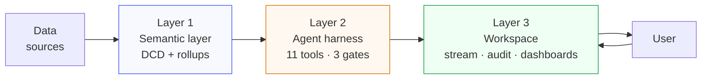
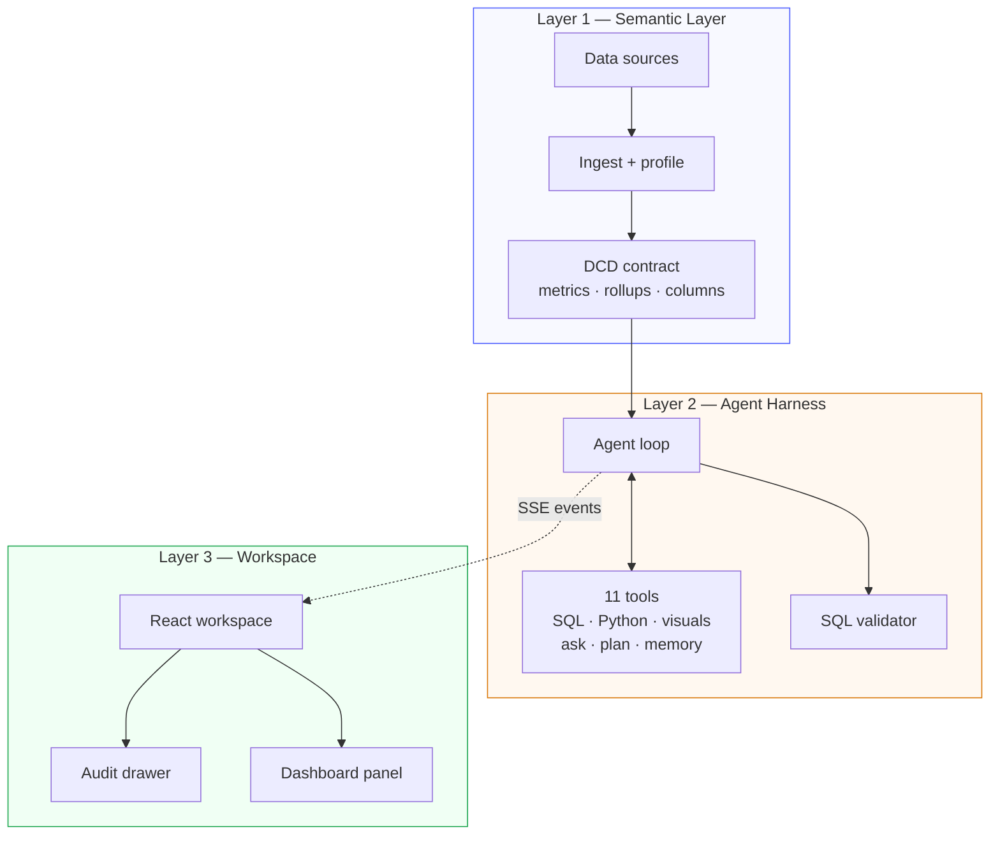
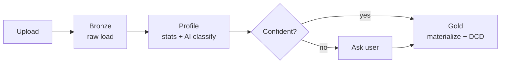
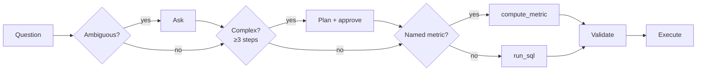
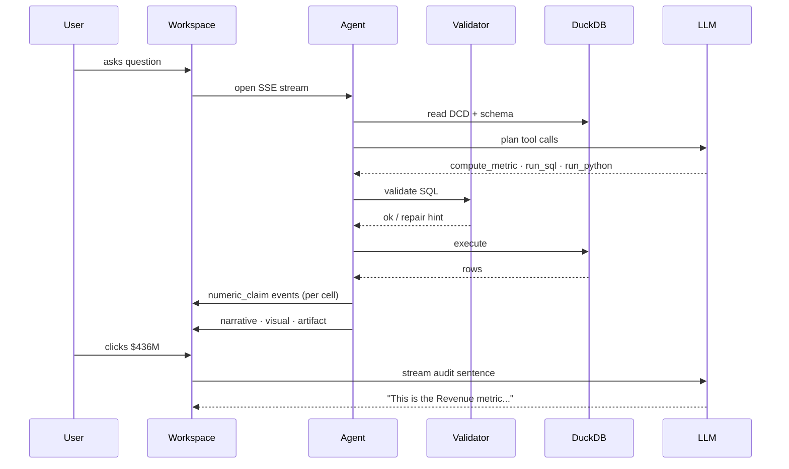

<p align="center">
  
</p>

<h1 align="center">Manthan</h1>

<p align="center">
  A business-intelligence agent with a governed semantic layer, a validated query engine, and an audit-first workspace.<br/>
  One self-hostable Apache-2.0 codebase. No vendor lock-in.
</p>

<p align="center">
  <strong>Live demo: <a href="https://manthan.quest">manthan.quest</a></strong>
</p>

<p align="center">
  <a href="https://manthan.quest"></a>
  <a href="https://www.python.org/downloads/"></a>
  <a href="https://react.dev/"></a>
  <a href="https://duckdb.org/"></a>
  <a href="https://fastapi.tiangolo.com/"></a>
  <a href="LICENSE"></a>
</p>

---

## Table of contents

- [The problem we're solving](#the-problem-were-solving)
- [Tech stack](#tech-stack)
- [Our approach](#our-approach)
- [Architecture](#architecture)
- [Layer 1 — the semantic layer](#layer-1--the-semantic-layer)
- [Layer 2 — the agent harness](#layer-2--the-agent-harness)
- [Layer 3 — the workspace](#layer-3--the-workspace)
- [Design decisions](#design-decisions)
- [Request lifecycle](#request-lifecycle)
- [Supported sources](#supported-sources)
- [Getting started](#getting-started)
- [API reference](#api-reference)
- [Project structure](#project-structure)
- [Development](#development)
- [Deployment](#deployment)
- [License](#license)

---

## The problem we're solving

"Talk to your data" tools have been everywhere this year. Scan the landscape and they sort into three buckets:

1. **Thin wrappers** — stuff the schema into a prompt, ask an LLM for SQL, execute, render.
2. **Vendor-locked AI analytics** — the Looker-Gemini, Cortex-Analyst, Genie tier. All solid, all require you to live inside the platform.
3. **Semantic-layer SDKs without a workspace** — beautifully-designed governance toolkits you wire into your own app. Metrics are governed; you still have to build the agent loop and the UI.

All three have the same ceiling. The first fails silently on real data — the industry benchmark shows enterprise text-to-SQL accuracy lives around 20–30%, and the failures aren't syntax errors. They're plausible wrong numbers that nobody catches. The second is great if you've already committed to the platform. The third leaves the hardest parts — the agent behaviour, the trust story, the workspace — as an exercise for the reader.

Manthan is the fourth option: a BI-native agent you run yourself. One repo, one Docker container, Apache 2.0. The semantic layer, the agent loop, the workspace, the audit trail — all in the same codebase, all replaceable piece by piece.

---

## Tech stack

<p align="center"><sub><b>Backend · API · agent loop</b></sub></p>
<p align="center">
  <a href="https://python.org"></a>
  <a href="https://fastapi.tiangolo.com"></a>
  <a href="https://www.uvicorn.org"></a>
  <a href="https://docs.pydantic.dev"></a>
  <a href="https://github.com/tobymao/sqlglot"></a>
  <a href="https://openrouter.ai"></a>
  <a href="https://cryptography.io"></a>
  <a href="https://dlthub.com"></a>
</p>

<p align="center"><sub><b>Data · analytics · sandbox</b></sub></p>
<p align="center">
  <a href="https://duckdb.org"></a>
  <a href="https://pandas.pydata.org"></a>
  <a href="https://numpy.org"></a>
  <a href="https://scikit-learn.org"></a>
  <a href="https://scipy.org"></a>
  <a href="https://www.statsmodels.org"></a>
  <a href="https://matplotlib.org"></a>
</p>

<p align="center"><sub><b>Frontend · workspace</b></sub></p>
<p align="center">
  <a href="https://react.dev"></a>
  <a href="https://www.typescriptlang.org"></a>
  <a href="https://vite.dev"></a>
  <a href="https://tailwindcss.com"></a>
  <a href="https://zustand-demo.pmnd.rs"></a>
  <a href="https://recharts.org"></a>
  <a href="https://lucide.dev"></a>
  <a href="https://motion.dev"></a>
</p>

<p align="center"><sub><b>Infrastructure · deploy · CI</b></sub></p>
<p align="center">
  <a href="https://docker.com"></a>
  <a href="https://nginx.org"></a>
  <a href="https://letsencrypt.org"></a>
  <a href="https://digitalocean.com"></a>
  <a href="https://fly.io"></a>
  <a href="https://github.com/features/actions"></a>
</p>

### The full stack, explained

#### Backend · API · agent loop

| Piece | What it does | Why we picked it |
|---|---|---|
| **FastAPI + uvicorn** | API server, SSE streaming, static bundle serving | First-class async, SSE-friendly, auto-generates OpenAPI from typed Pydantic models |
| **Pydantic v2** | Typed contracts for DCD, events, requests | Sub-millisecond validation on every tool call, zero boilerplate |
| **SQLGlot** | AST-level SQL validation before DuckDB sees the query | Dialect-aware; catches hallucinated tables, missing metric filters, unknown columns at parse time |
| **OpenRouter** | Model-agnostic LLM gateway | Swap Claude, GPT, Llama, DeepSeek without touching code; free tier covers everything in the demo |
| **`cryptography.fernet`** | Envelope-encrypted credential vault | Per-tenant data-key model, CMK hook for enterprise rotation |
| **`dlt`** | SaaS connector scaffolding (Stripe, HubSpot, Salesforce, etc.) | Apache-2.0, Python-native, DuckDB destination first-class |

#### Data · analytics · sandbox

| Piece | What it does | Why we picked it |
|---|---|---|
| **DuckDB** | Embedded columnar engine — every query, every source | Single-process, fast, read-only `ATTACH` for Postgres/MySQL, `httpfs` for S3/GCS/Azure |
| **pandas + NumPy** | DataFrame layer in the Python sandbox | Tool-chain the agent already knows; universal I/O |
| **scikit-learn** | Clustering, scaling, classical ML | K-means, linear, logistic — the shapes real BI questions actually need |
| **statsmodels + SciPy** | Seasonal decomposition, hypothesis tests, forecasts | Classical stats the agent reaches for when SQL runs out of runway |
| **matplotlib** | Fallback figure rendering inside the sandbox | Always available; artifact chart path prefers Chart.js/D3 but matplotlib backs Python-first flows |

#### Frontend · workspace

| Piece | What it does | Why we picked it |
|---|---|---|
| **React 19 + Vite + TypeScript** | SPA shell, bundling, type safety end-to-end | Concurrent rendering, sub-second HMR, typed SSE event contracts |
| **Tailwind 4** | Utility-first CSS with the new engine | Brand theming at the token level, zero runtime cost |
| **Zustand** | Client state — one slice per domain (agent, datasets, artifact, processing) | Minimal ceremony, selector-based re-renders, devtools middleware |
| **Recharts** | Inline chart rendering in the conversation stream | Composable, SVG-native, easy to theme |
| **Lucide** | Icon system | Tree-shakeable, consistent weight, 1,500+ icons |
| **Motion** | Declarative animations (artifact slide-in, ask-user card rise, skeleton pulse) | Physics-based, preserves 60fps even while layout is thrashing |
| **`simple-icons`** | Brand marks for the SaaS source picker | CC0, comprehensive, one import per brand |
| **Custom `SmoothText` engine** | Grapheme-safe, animation-frame-paced token reveal | In-house — decouples SSE burstiness from render rhythm so the text never stutters |

#### Infrastructure · deploy · CI

| Piece | What it does | Why we picked it |
|---|---|---|
| **Docker + Compose** | Single-container app, bind-mounted `./data` | One `docker compose up` deploys everything end-to-end |
| **nginx** | TLS termination, SSE-safe reverse proxy (`proxy_buffering off`, 300s read timeout) | The 90% case for self-hosters |
| **Let's Encrypt + certbot** | Auto-renewed certs via systemd timer | Free, reliable, 90-day rotation with zero-touch renewal |
| **DigitalOcean / Fly.io** | Current deploy targets — `manthan.quest` on a 2vCPU/4GB DO droplet | Low fixed cost, enough for a full team's workload |
| **GitHub Actions** | CI — ruff, pytest, npm build, npm typecheck on push/PR | Free for public repos, fast feedback |

**Licensing — every runtime dependency is Apache 2.0, MIT, BSD, or PSF.** No proprietary agent runtime. No vendor-locked semantic layer format. No telemetry. You can fork this and ship it commercially — the only ask is attribution.

---

## Our approach

Three layers, one idea: **every number the agent cites should be traceable back to a declaration, not a prompt guess.**

- **Layer 1** builds the declaration — a semantic layer called the DCD (Data Context Document). Columns get classified, metrics get defined with always-applied filters, rollups get pre-materialized. The agent reads this contract before every query.
- **Layer 2** is the agent itself — not a single prompt calling a single SQL tool, but a loop with eleven tools, three decision gates, a pre-execution SQL validator, and a Python sandbox for the questions SQL can't answer. It asks when it's unsure. It plans when the task is deep. It remembers across sessions.
- **Layer 3** is the workspace — streaming conversation, click-to-audit on every number, sandboxed dashboards with self-repair, word-by-word text reveal. Not a chat box. A place analysts can actually work.



---

## Architecture



Each layer has a clean contract with the one below it. You can replace any layer without touching the others — the DCD is plain YAML, the agent talks JSON, the frontend is just SSE and REST.

---

## Layer 1 — the semantic layer

**The problem.** Upload a CSV and the database sees `amount_usd INTEGER`. A useful question like *"what's our average order value?"* needs the system to know that's a monetary field, it's safe to average, and it should probably be grouped by something meaningful. Without that context, every LLM is guessing.

**What we built.** A typed, versioned semantic layer we call the DCD — the Data Context Document. It's a YAML file per dataset with three things that matter most:

- **Entities** — stable business handles over physical tables. You re-ingest the data and the entity slug survives; the physical table pointer rotates underneath.
- **Metrics** — governed definitions like *revenue = SUM(subtotal) where status='delivered'*. The filter is always applied. The aggregation semantics (*can you sum this across slices, or is it a ratio?*) are declared. The dimensions it's safe to slice by are whitelisted.
- **Rollups** — pre-materialized summary tables (by status, by day, by region) so common questions don't scan the full dataset.

**The ingestion pipeline that builds it.**



The profiler runs an AI classifier over every column: metric, dimension, temporal, identifier, auxiliary. When it's under-confident on anything important, the ingest pipeline *stops and asks you*, with the proposed interpretation and a redirect option:

> *"'age' has 74 different numeric values. How do you use it?"*
> — `[I'd group or filter by it]` · `[It's an identifier]` · `[I'd calculate with it]` · or type your own

Your answer is baked into the DCD. The next time the agent touches that dataset, it reads the contract and uses `age` as a dimension, not a metric. No guessing.

**Why the DCD matters for trust.** The alternative is asking an LLM to look at raw column names every single query. When it gets "Revenue" wrong — conflating gross bookings with paid-subscription-active — nobody notices until the numbers in two dashboards disagree. The DCD is the contract that prevents that.

**Versioning.** Every edit appends a full snapshot to a changelog on disk. *"What did Revenue mean on March 15?"* is a line lookup, not an archaeological expedition.

**Credentials.** Connection strings to Postgres / MySQL / S3 / GCS go into a Fernet envelope-encrypted vault. The agent never sees them; they're decrypted only inside the attach call, used once, and the plaintext never hits disk.

---

## Layer 2 — the agent harness

**The problem.** A lot of "AI data analyst" products are a prompt with one or two tools — a SQL generator and maybe a chart renderer. That's fine for toy questions. It falls apart the moment someone asks:

- *"If California keeps spending at the current pace, when does the surplus run out?"* (forecast — needs regression)
- *"Group the 50 states into fiscal-health tiers based on 2019."* (clustering — needs KMeans)
- *"Which states are unusual compared to their neighbours?"* (outlier detection — needs statistical tests)

None of these are SQL questions. They need a real computational environment, and they need an agent smart enough to reach for it.

**What we built.** An agent loop with eleven tools, not two. The agent picks what to use based on the question shape:

| Tool | What it does | When the agent picks it |
|---|---|---|
| `get_schema` / `get_context` | Read the DCD | Default first move on any new turn |
| **`compute_metric`** | **Governed path** — SQL composed from a named metric | Question names a metric we've defined (`revenue`, `churn`) |
| `run_sql` | Read-only SQL against DuckDB | Ad-hoc slice not covered by a metric |
| **`run_python`** | **Stateful sandbox with pandas, sklearn, numpy, matplotlib** | Forecast, cluster, correlate — anything SQL can't express |
| `ask_user` | Blocking clarification with chip options | Genuinely ambiguous question |
| `create_plan` | Multi-step plan with approval gate | Task needs 3+ tool calls |
| `save_memory` / `recall_memory` | Cross-session findings | End of a significant analysis / start of a related one |
| `emit_visual` | Inline chart in the conversation | Single-chart answers |
| `create_artifact` | Sandboxed HTML dashboard in the side panel | Multi-chart dashboards, long reports |

**SQL and Python both matter.** Most BI agents stop at SQL. That means half the interesting questions — anything requiring a regression, a forecast, a clustering, a statistical test — just can't be answered well. Our Python sandbox runs in a stateful subprocess with pandas, DuckDB, numpy, sklearn, scipy, and matplotlib pre-loaded. The agent can chain a SQL pull into a Python analysis into a chart, all in one turn.

**Three decision gates, not autonomous-everywhere.**



- **Ask gate.** If two equally thoughtful analysts would disagree on what the question means, stop and ask. Most agents guess. Guessing is where trust dies.
- **Plan gate.** If the task needs three or more tool calls against expensive data, the agent writes a plan with DCD citations and waits for approval before executing. You see what it's about to do before it does it.
- **Governed-metric gate.** If the question mentions a named metric, the agent takes the governed path — SQL composed deterministically from the contract, with the always-applied filter baked in. It literally cannot forget to filter delivered orders when computing revenue.

**Pre-execution SQL validation.** When the agent writes its own SQL, a separate step parses the query into an AST and walks it against the DCD catalog *before* the database ever sees it. Three things get caught at parse time:

- Referencing a table that doesn't exist in the DCD.
- Referencing a column that isn't declared.
- Aggregating a metric's underlying column without the metric's always-applied filter (we call this a *metric-filter violation*).

On any of those, the agent gets an error with a specific repair hint and retries. No warehouse round-trip on the failure path. No silent wrong results.

**The ground-truth rule.** Every specific number the agent cites in prose has to come from a tool call it ran in the current turn — no prior-session memory, no training-data guesses, no "around $400 million" hand-waving. If the agent emits numbers without running a tool, the loop nudges it once ("run a tool to verify") and retries. This catches the single most common failure mode in LLM deployments: confident quotes from training data.

**Cross-session memory.** When the agent finishes a significant analysis, it can save key findings to a local SQLite store. The next time you open a related dataset, it recalls those findings at the top of the turn. Yesterday's analysis isn't lost the moment you refresh.

---

## Layer 3 — the workspace

**The problem.** Most AI analytics UIs are a chat box with a chart below it. That's fine for demos. It falls short the moment you want to verify a number, compare two analyses side by side, or know *why* the agent said what it said.

**What we built.** A workspace — not a chat. Three design choices shape it.

### 1. Streaming everything, smoothly

The agent's thinking, narrative, ask-user prompts, and audit trails all come over Server-Sent Events. But raw SSE is bursty — tokens clump, chunks arrive every 200ms in fits and starts. If you just render them as they land, the UI feels stuttery.

We built a jitter buffer (`SmoothText`) that decouples ingestion from presentation. An animation-frame loop reveals characters at an adaptive pace — slower when the stream is catching up, faster when there's a backlog. Grapheme-safe so emoji don't split mid-reveal. Same rhythm on a 60Hz laptop screen and a 240Hz gaming monitor.

Side-by-side: a stock SSE chat app reveals in chunks. Manthan reveals word by word at a human reading pace. Small thing, huge difference in how intelligent the system feels.

### 2. Click any number, see its provenance

Every numeric value the agent cites in prose is click-to-audit. A drawer slides in from the right and *streams* an audit sentence grounded in the DCD:

> *"This is the Revenue metric (governed slug `revenue`) from the Orders entity. Per the contract, it sums delivered-order subtotals where `status = 'delivered'`. For this answer it was further filtered to `State = 'California'`. Calculated from 4,820 of 12,300 rows from the Orders dataset (from `orders.csv`, ingested 18 April 2026)."*

Under the hood, every number is paired with a structured lineage event — the metric slug, the filters applied, the SQL executed, the row count scanned, the dataset it came from. The drawer reads that structure and asks the LLM to write an auditor-grade sentence citing it. If the model hallucinates or drifts into planning dialogue, we detect it and fall back to a regex-built summary from the structured data. You're never stuck staring at a blank drawer.

There's a technical detail section too — copy-SQL button, query metadata chips (rows scanned, dimensions, grain), run trace id for log correlation. Analysts can drill into the exact query; business users can stop at the one-paragraph sentence.

### 3. Dashboards that repair themselves

When the agent decides an answer deserves a dashboard, it writes an HTML artifact with Chart.js or D3 inside. The artifact renders in a sandboxed iframe.

Two things protect against broken dashboards:

- **Before the artifact ships**, we extract the inline `<script>` and syntax-check it with `node --check`. If it's broken, a focused repair pass fires one LLM call to fix the parse error. Re-check, ship. Silent-ok the common case.
- **After the artifact renders**, an injected error listener catches runtime crashes — the Chart.js config throws, a global is undefined — and posts them up to the parent window. A red banner appears: *"Your query failed"* with the original question, the error, and a **Retry query** button. One click, the failed turn is replaced in the transcript, the question is re-sent to the agent with the failure reason appended. More often than not, the agent picks a simpler chart path on the retry.

Most AI dashboards render and pray. Ours renders, watches, and fixes.

### 4. A real ingest wizard, not a file picker

Drop a CSV. The wizard walks through six stages — upload, scan, profile, classify, enrich, materialize — with live progress and Lottie animations. When the classifier is under-confident, the wizard pauses on a clarification panel: proposed interpretation, why it matters, three chip options, free-text redirect. You answer, it continues. The six stages are visible as a rail so you know exactly where you are.

The same picker handles cloud URLs (`s3://`, `gs://`, `az://`, `https://`), database connections (Postgres, MySQL, SQLite) with client-side form validation *plus* a raw-connection-string toggle for the engineers who prefer to paste, and brand-iconed chips for a bunch of SaaS sources.

---

## Design decisions

The non-obvious choices. Not implementation notes — the decisions we debated and why we landed where we did.

### Semantic layer first, prompts second

Every serious AI-analytics benchmark in 2026 says the same thing: raw text-to-SQL caps out around 20–30% accuracy on real enterprise schemas. Semantic-layer grounding hits 98%+ on covered queries and, critically, **refuses to answer out-of-scope questions instead of inventing**. We built the DCD before we built the agent. The agent is a client of the semantic layer, not the other way around.

### Govern the happy path, don't just hint at it

A common pattern is to give the LLM a "system prompt with metric definitions" and hope it uses them. Hope isn't a strategy. We made `compute_metric` a first-class tool that takes a metric slug and composes SQL from the contract deterministically. The LLM picks the slug; the backend writes the SQL. There's no path where the model can forget the always-applied filter.

### Validate at parse time, not after the warehouse round-trip

If the agent writes a bad query, we want to catch it before DuckDB does. SQL parsing is cheap; warehouse round-trips cost latency and (in production) real dollars. The AST walk runs in under a millisecond; a failed query runs in seconds. Multiply that by retry loops and it matters.

### Ask when unsure — and block until answered

Most agents guess and apologize. We added a blocking `ask_user` that stops the turn cold and renders a clarification card in the UI. The question waits. The user answers. The turn continues. In a production run this happens maybe once every five questions, and every one of those is a question that would have returned a wrong answer otherwise.

### Plans for complex turns, direct execution for simple ones

We considered making every turn go through a plan-approval gate. It would have been annoying. We settled on a heuristic — if the turn needs three or more tool calls against expensive data, surface a plan with DCD citations and wait for approval. Single-step questions fly through. Multi-step investigations get a checkpoint.

### SQL *and* Python, equally important

Many BI agents are SQL-only. That means questions involving clustering, forecasting, or statistical tests just can't be answered well. We built a stateful Python sandbox — pandas, DuckDB, numpy, sklearn, scipy, matplotlib — as a first-class tool. The agent chains SQL (pull the data) into Python (run the analysis) into a chart or artifact. Questions like "group the states into fiscal-health tiers" become tractable.

### Lineage events, not just final answers

We made the bet early that audit shouldn't be a feature added later. Every tool result auto-emits a structured lineage event per cell, not per answer. Clicking any number — not just the headline figure, but any cell in a table the agent produced — opens the audit drawer with full provenance. This is what "traceable" actually means.

### Artifacts are code, and code breaks — so repair it

Letting an LLM write inline JavaScript for a dashboard is asking for syntax errors. We run every artifact through `node --check` and fire a one-shot repair pass on broken syntax. Runtime errors that get through are caught by an injected bridge in the iframe and surfaced as a retry prompt. The result is a dashboard pipeline that fails loudly and fixes itself instead of silently rendering a blank panel.

### Refresh-in-place, not refresh-from-scratch

When you re-upload a dataset (new month of data, corrected source file), most tools wipe your work. We kept the entity slug stable, rotated the physical table pointer atomically, and preserved every user-authored edit — renamed columns, custom metric labels, PII flags, synonyms. Refresh becomes cheap; your work compounds instead of resetting.

### One codebase, not a microservice pile

The agent, the semantic layer, the workspace, the ingest pipeline — all in one repo, one Docker container. No Kubernetes, no external Postgres checkpointer, no separate state service. FastAPI serves the API and the built React bundle on a single port. You can fork this and deploy it to a $5 VM. That decision wasn't laziness; it was a bet that self-hostable beats cloud-native for the 90% of use cases that are a team or a division, not a multi-tenant SaaS.

### Apache 2.0, no platform lock-in

Every runtime dependency is Apache 2.0, MIT, BSD, or PSF licensed. No proprietary agent runtime. No vendor-specific semantic layer format. You can swap OpenRouter for a self-hosted model, DuckDB for Postgres, React for whatever comes next. The interesting parts — the DCD schema, the validator rules, the event model — are the parts you'd want to keep portable anyway.

---

## Request lifecycle

One turn, end to end.



The key idea: the stream doesn't end at the answer. Clicking a number kicks off a second SSE stream for the audit trail. Everything the user looks at has lineage, on demand.

---

## Supported sources

Four tabs in the source picker. Three of them ship wired, the fourth is UI-ready with the connector work in progress.

| Tab | What it covers | Status |
|---|---|---|
| **Files** | CSV, TSV, Parquet, Excel, JSON, multi-file bundles with foreign-key auto-detection | production |
| **Cloud URL** | `https://`, `s3://`, `gs://`, `az://` — public URLs ingest without credentials; saved connections (encrypted) for private buckets | production |
| **Database** | Postgres, MySQL, SQLite via DuckDB read-only attach. MySQL handles both libpq-style and native-style connection strings | production |
| **Apps (SaaS)** | Stripe, HubSpot, Salesforce, Shopify, Notion, Airtable, Google Ads, Meta, GitHub, Slack — brand-iconed UI | UI complete · backend via `dlt` is the next milestone |

---

## Getting started

> **Prefer to poke at it first?** A live instance runs at **[manthan.quest](https://manthan.quest)** — upload any CSV and work through the flow without installing anything.

### Prerequisites

- Python **3.12+**
- Node **20+**
- An [OpenRouter](https://openrouter.ai) API key (free tier works for everything in this README)

### With Docker

```bash
git clone https://github.com/hitakshiA/Manthan.git
cd Manthan
cp .env.example .env                  # paste your OPENROUTER_API_KEY
docker compose up --build
```

Open `http://localhost:8000`. The Docker build compiles the React bundle and serves it from FastAPI on a single port. Mount `./data:/app/data` so your DCDs, DuckDB state, and credential vault survive restarts.

### Local dev (hot reload)

```bash
# backend
python -m venv .venv && source .venv/bin/activate
pip install -e ".[dev]"
uvicorn src.main:app --reload            # :8000

# frontend (new terminal)
cd manthan-ui
npm install
npm run dev                              # :5173 (Vite proxies /api)
```

Visit `http://localhost:5173`.

### Your first five minutes

1. Hit **Upload** in the sidebar. Drop any CSV on the Files tab — `penguins.csv`, `orders.csv`, anything.
2. The processing wizard walks through six stages. When it pauses on the clarification panel, answer the ambiguous columns.
3. From the dataset profile, click **Start analyzing**.
4. Ask something. Watch the thinking, tool calls, and narrative stream live.
5. Click any number in the answer. The audit drawer opens and streams its provenance.

That's the full loop. Everything else is depth.

---

## API reference

Fourteen routers mounted on FastAPI. `/docs` serves the full OpenAPI spec.

| Path | Purpose |
|---|---|
| `GET /health` | Liveness |
| `POST /datasets/upload` · `upload-multi` | Single file or bundle ingest |
| `POST /datasets/connect` · `connect-url` | Database or cloud-URL ingest |
| `POST /datasets/{id}/refresh` | Re-ingest preserving user edits |
| `GET /datasets` · `{id}/schema` · `{id}/context` | Dataset listing and DCD access |
| `POST /tools/sql` · `metric` · `python` | Direct tool invocations |
| `POST /agent/query` | **SSE** — the agent loop |
| `POST /audit/describe-claim` | **SSE** — the audit drawer stream |
| `POST /ask_user/{qid}/answer` | Submit a clarification answer |
| `POST /plans/{pid}/approve` | Approve a proposed plan |
| `GET/POST /memory` | Cross-session memory store |
| `POST /connections` | Save a warehouse credential (encrypted) |
| `POST /subagents/spawn` | Spawn a parallel isolated analysis |

---

## Project structure

```
manthanv2/
├── src/                           # Python backend
│   ├── agent/                     # Loop, tools, prompt, events, artifact repair
│   ├── api/                       # 14 FastAPI routers
│   ├── semantic/                  # DCD schema, generator, validator, history
│   ├── ingestion/                 # Loaders for files, URLs, databases
│   ├── profiling/                 # AI classifier + heuristic fallback
│   ├── materialization/           # Rollups + verified queries
│   ├── tools/                     # Backing fns for compute_metric, run_sql, run_python
│   ├── sandbox/                   # Python subprocess REPL
│   ├── core/                      # Config, state, LLM client, credentials vault
│   └── main.py
│
├── manthan-ui/                    # React frontend
│   └── src/
│       ├── components/
│       │   ├── layout/            # App shell
│       │   ├── conversation/      # Streaming activity cards
│       │   ├── workspace/         # Query input
│       │   ├── artifact/          # Dashboard iframe + error bridge
│       │   ├── audit/             # Calculation drawer, history drawer
│       │   ├── datasets/          # Source picker, processing wizard, connectors
│       │   └── render/            # Simple / Moderate / Complex view dispatcher
│       ├── hooks/                 # SmoothText, claim description, retry query
│       ├── stores/                # Zustand slices
│       ├── api/                   # HTTP + SSE clients
│       └── lib/                   # SmoothText engine, semantic graph
│
├── tests/                         # 136+ tests across 46 files
├── pyproject.toml
├── Dockerfile
├── docker-compose.yml
├── fly.toml
├── .env.example
└── README.md
```

---

## Development

> Full stack breakdown lives in **[Tech stack](#tech-stack)** at the top of the README.

### Environment

All configuration via `.env`. See `.env.example`. Minimum to run:

```env
OPENROUTER_API_KEY=sk-or-...
OPENROUTER_MODEL=openai/gpt-oss-120b:free
DATA_DIRECTORY=./data
```

Optional: tuning for DuckDB memory and threads, a custom vault master key for production-grade credential rotation, log format.

### Testing

```bash
pip install -e ".[dev]"
pytest tests/ -q                          # 136+ tests, ~15s
```

### Linting

```bash
ruff format src/ tests/ && ruff check src/ tests/
cd manthan-ui && npm run typecheck && npm run lint
```

### CI

`.github/workflows/ci.yml` runs ruff + pytest on push and PR.

### Extending it

- **New file format?** Implement the `DatasetLoader` protocol in `src/ingestion/base.py`, register in the loader registry.
- **New tool?** Add it to `TOOL_DEFINITIONS` in `src/agent/tools.py` and handle the dispatch.
- **New event type?** Factory in `src/agent/events.py`, type + handler in `manthan-ui/src/types/events.ts`.
- **New field on the DCD?** Extend `src/semantic/schema.py` and the validator, prompt, and frontend pick it up from the typed model.
- **New SaaS connector?** Wire a `dlt` source in `src/ingestion/dlt_runner.py`.

---

## Deployment

### Docker Compose

```bash
docker compose up --build -d
```

Single container. Mount a volume at `/app/data` for persistence. Health check on `/health`.

### Fly.io

```bash
fly deploy
```

`fly.toml` is checked in. Set `OPENROUTER_API_KEY` and `MANTHAN_VAULT_MASTER_KEY` via `fly secrets`.

### Anywhere else

Standard OCI container, ports 8000 exposed. SSE endpoints need HTTP/1.1 or HTTP/2 with per-chunk flush — avoid proxies that buffer streams (`proxy_buffering off` on nginx).

---

## License

[Apache 2.0](LICENSE). The DCD schema, the validator rules, the audit event model, every prompt, every component — open. Fork it, change it, embed it, ship it commercially. Only ask is you keep the attribution.

---

<p align="center">
  <a href="https://github.com/hitakshiA/Manthan">github.com/hitakshiA/Manthan</a><br/>
  Built by <a href="https://github.com/hitakshiA">Hitakshi Arora</a>.
</p>
