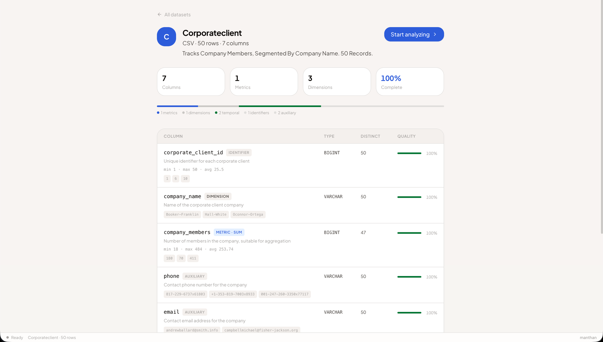
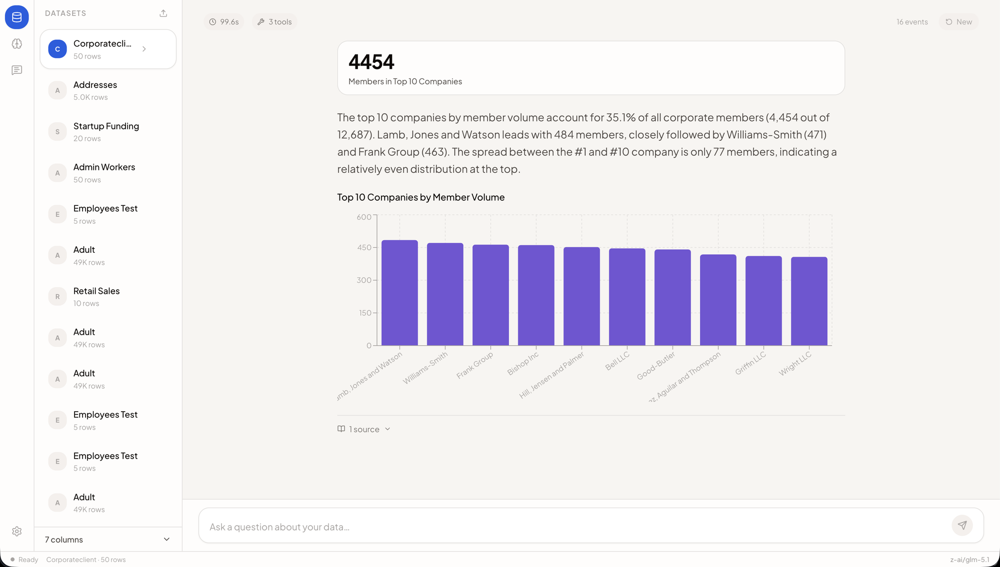
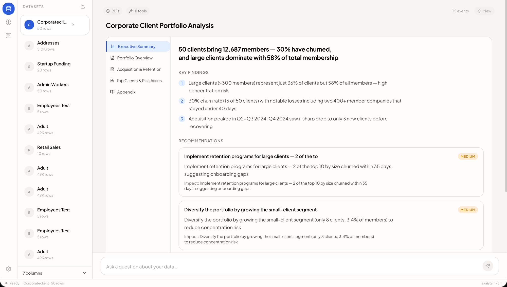
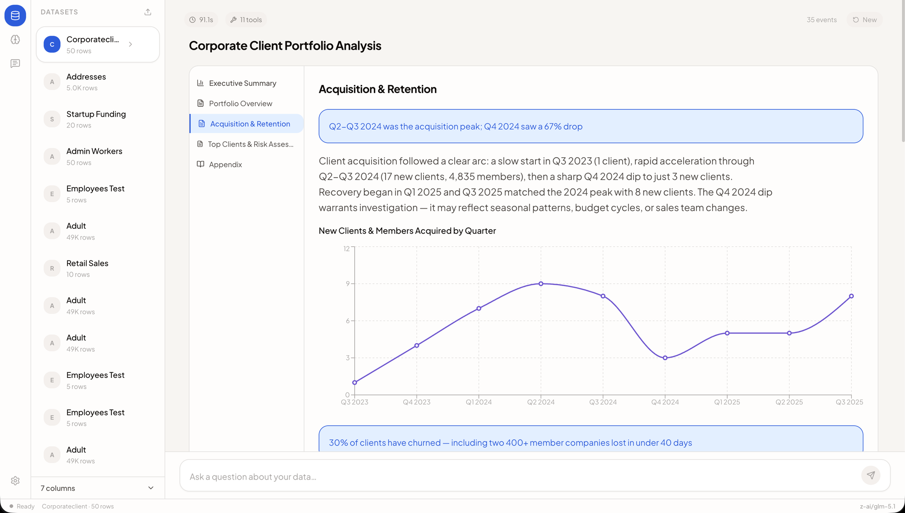

<p align="center">
  
</p>

<h1 align="center">Manthan</h1>

<p align="center">
  An autonomous agent harness with a semantic data layer<br/>
  that turns any dataset into dashboards and reports — without hallucinating.
</p>

<p align="center">
  <strong><a href="https://manthan.quest">manthan.quest</a></strong>
</p>

<p align="center">
  <a href="https://github.com/hitakshiA/Manthan/actions/workflows/ci.yml"></a>
  <a href="https://www.python.org/downloads/"></a>
  <a href="LICENSE"></a>
  <a href="https://manthan.quest"></a>
</p>

---

## The problem with every "talk to your data" tool

They all fail the same way. The AI sees `payment_type INTEGER` and sums it. It treats `age` as a metric instead of a dimension. It guesses what "last month" means. When the model goes down, the whole system crashes. And the output is always a wall of text — never the dashboard the business user actually needs.

**Manthan solves this with two things no other tool has: a semantic layer that understands data before the agent touches it, and an agent harness that thinks, plans, and asks before it acts.**

---

## Layer 1 — The Semantic Layer

Upload a CSV and Manthan doesn't just dump it into a database. It runs an AI classifier over every column — detecting whether each one is a metric you'd sum, a dimension you'd group by, a temporal axis for trends, or an identifier to ignore. It writes descriptions, computes statistics, and measures data quality.

When the classifier isn't confident, **it stops and asks you**:

```
Manthan: "'age' has 74 different numeric values (like 35, 59, 56).
          How do you use it?"

  [I'd calculate with it (sum, average)]  [I'd group or filter by it]  [It's an ID]
```

Your answer gets locked into the **Data Context Document (DCD)** — a structured semantic layer that the agent reads before every query. The result is a rich dataset profile:

<p align="center">
  
</p>

Every column has an AI-generated description, a role badge, min/max/mean statistics, sample values, cardinality, and a completeness bar. Pre-built summary tables and verified queries are materialized automatically. The agent never guesses — it reads confirmed definitions.

---

## Layer 2 — The Agent Harness

The agent isn't a simple text-to-SQL translator. It's an autonomous reasoning loop with **8 tools**, **3 decision gates**, and **cross-session memory** — orchestrated through a single `while` loop that runs until the model stops emitting tool calls.

### Decision gates

Before executing anything, the agent reasons through three gates:

1. **Clarification gate** — If the question is ambiguous ("What changed last month?"), the agent calls `ask_user` with structured options and **blocks until you answer**. No guessing.

2. **Planning gate** — If the task needs 3+ tool calls, the agent creates a structured plan with steps, citations from the DCD, and expected cost — then **waits for your approval** before executing.

3. **Complexity gate** — The agent decides the output mode early: **Simple** (one KPI + one chart), **Moderate** (multi-section dashboard), or **Complex** (multi-page report with executive summary and recommendations).

### 8 tools

| Tool | What it does |
|------|-------------|
| `get_schema` | Reads the semantic layer — column roles, descriptions, verified queries |
| `get_context` | Full DCD as YAML, optionally pruned to relevant columns |
| `run_sql` | Read-only SQL against Gold tables (supports temp tables, DESCRIBE) |
| `run_python` | Stateful Python sandbox — variables persist across calls |
| `ask_user` | Blocking clarification with options (30s timeout, then best guess) |
| `create_plan` | Structured plan with approval gate (30s auto-approve) |
| `save_memory` | Persists conclusions to cross-session SQLite store |
| `recall_memory` | Retrieves prior analysis at the start of every new query |

### Cross-session memory

After a complex analysis, the agent saves key findings to a persistent SQLite-backed memory store. The next time you ask a related question — even in a new session — the agent recalls those conclusions and builds on them. Yesterday's analysis isn't lost.

### 22 SSE event types

Every decision, tool call, and result streams to the frontend in real-time via Server-Sent Events. The user watches the agent think — scanning tables, loading schema, running SQL, executing Python, creating plans — with each step rendered as a live activity card.

---

## Layer 3 — The Workspace

The frontend isn't a chatbot. It's a workspace that renders the agent's structured output as interactive dashboards, paginated reports, and KPI cards — using the `render_spec.json` contract between Layer 2 and Layer 3.

### Simple output — one question, one answer

<p align="center">
  
</p>

### Complex output — multi-page analytical report

For deep analysis, the agent produces a paginated report with an executive summary, key findings, recommendations with confidence levels, and dedicated analysis pages:

<p align="center">
  
</p>

Each page has its own narrative, charts, and insight callouts — navigable via the sidebar:

<p align="center">
  
</p>

---

## What makes this different

| Capability | Manthan | Typical text-to-SQL tool |
|---|---|---|
| **Understands data before querying** | AI classifies every column; asks user when unsure | Sees raw DDL, guesses column meaning |
| **Plans before executing** | Shows plan with citations, waits for approval | Executes immediately, no visibility |
| **Remembers across sessions** | SQLite-backed memory; recalls yesterday's analysis | Stateless — starts from scratch every time |
| **Produces structured output** | KPI cards, dashboards, multi-page reports | Text + maybe one chart |
| **Never crashes on model failure** | 3-model cascade + deterministic heuristic fallback | Single model, crashes on rate limit |
| **Streams agent activity** | 22 SSE event types, real-time tool execution cards | Returns final text, no visibility into process |
| **Human-in-the-loop** | Blocks on ambiguity (ask_user) and complexity (plan approval) | Guesses silently |

---

## Run it

```bash
git clone https://github.com/hitakshiA/Manthan.git && cd Manthan
cp .env.example .env   # add your OPENROUTER_API_KEY
docker compose up --build
```

Open **http://localhost:8000** — the frontend and API run on the same port.

Or without Docker:

```bash
# Backend
python -m venv .venv && source .venv/bin/activate
pip install -e ".[dev]"
uvicorn src.main:app --reload

# Frontend (separate terminal)
cd manthan-ui && npm install && npm run dev
```

**Get an API key:** Sign up at [openrouter.ai](https://openrouter.ai) — free tier works out of the box. No credit card needed.

### Live demo: **https://manthan.quest**

---

## Resilience

The system doesn't crash when things go wrong.

| Failure | What happens |
|---------|-------------|
| Primary model rate-limited | Instant cascade to fallback model (3-model chain) |
| All models unavailable | Deterministic heuristic classifier runs — no AI model needed |
| Agent tool call fails | Retries up to 3 times, then explains the issue to the user |
| Python sandbox errors | Agent reads stderr, fixes code, retries (up to 3 attempts) |
| Server restarts | Datasets rehydrate from Parquet on disk; memory persists via SQLite WAL |

---

## Benchmark results

Tested against [CORGI](https://github.com/corgibenchmark/CORGI) — the hardest public text-to-SQL benchmark for business databases. Synthetic schemas modeled after real companies with 18–35 tables, 25–68 foreign keys, and queries requiring 7+ JOINs on average.

| Database | Tables | FKs | Rows | Result |
|----------|--------|-----|------|--------|
| Food Delivery | 32 | 25 | 75K | **8/8 passed** |
| Clothing E-commerce | 35 | 40 | 140K | **6/6 passed** |
| Car Rental | 31 | 68 | 169K | **6/6 passed** |

The agent discovers 30+ tables autonomously via `SHOW TABLES`, describes relevant ones, writes multi-table JOINs, and produces structured answers — all without human guidance.

---

## Architecture

```
Layer 1 — Data Pipeline + Semantic Layer
  Upload → Bronze (DuckDB) → Silver (AI classify) → Clarify → Gold (materialize)
  Output: Data Context Document (DCD) with column roles, stats, verified queries

Layer 2 — Autonomous Agent Harness
  While loop: agent reasons → emits tool calls → observes results → iterates
  8 tools, 3 decision gates, cross-session memory, subagent spawning
  Output: render_spec.json (structured visualization contract)

Layer 3 — React Workspace
  SSE stream renders agent activity in real-time
  render_spec.json → Simple / Moderate / Complex views
  Interactive charts (Recharts), KPI cards, paginated reports
```

## API surface

| Method | Endpoint | Purpose |
|--------|----------|---------|
| POST | `/datasets/upload` | Upload → classify → clarify → materialize Gold |
| GET | `/datasets/{id}/schema` | Column roles, stats, descriptions, quality |
| POST | `/agent/query` | SSE stream — real-time agent activity |
| POST | `/tools/sql` | Read-only SQL against Gold tables |
| POST | `/tools/python` | Stateful Python sandbox |
| POST | `/plans` | Structured plan with approval gate |
| POST | `/ask_user` | Blocking human-in-the-loop clarification |
| POST | `/memory` | Cross-session persistent key-value store |
| POST | `/subagents/spawn` | Isolated parallel analysis workspaces |

## Tech stack

| Component | Technology |
|-----------|-----------|
| API | FastAPI + uvicorn |
| Database | DuckDB (in-memory + Parquet persistence) |
| Agent Model | OpenRouter (model-agnostic — any provider via .env) |
| Persistence | SQLite WAL (memory + plan audit trail) |
| Sandbox | Python subprocess REPL with persistent state |
| Frontend | React 19 + Vite + Tailwind CSS 4 + Recharts |
| State | Zustand (agent phase machine + stores) |

All dependencies are Apache 2.0, MIT, or BSD licensed.

## Project structure

```
src/
  agent/            # Layer 2: agent loop, 8 tools, prompt, SSE events
  api/              # 13 FastAPI routers (datasets, tools, agent, plans, memory...)
  core/             # Config, model client, rate limiting, memory, plans
  ingestion/        # Bronze: 5 format loaders, FK detection, registry
  profiling/        # Silver: AI + heuristic classifier, interactive clarification
  semantic/         # DCD schema, render spec models + normalizer
  materialization/  # Gold: optimizer, summarizer, verified query generator
  tools/            # SQL tool, Python session manager
  sandbox/          # REPL worker subprocess

manthan-ui/
  src/
    stores/         # Zustand: agent phase machine, datasets, session, UI
    components/
      layout/       # App shell: ActivityBar, Sidebar, MainWorkspace
      workspace/    # QueryInput, ActivityFeed, 22 SSE event renderers
      render/       # SimpleView, ModerateView, ComplexView + Recharts
      hitl/         # AskUserCard, PlanApprovalCard (inline, not modals)
      datasets/     # Uploader, ColumnClassifier, RoleBar, SchemaViewer

tests/              # 294 tests across 7 directories
```

## Development

```bash
pip install -e ".[dev]"
ruff format src/ tests/ && ruff check src/ tests/
pytest tests/ -q  # 294 tests, ~14s
```

## License

[Apache 2.0](LICENSE)
