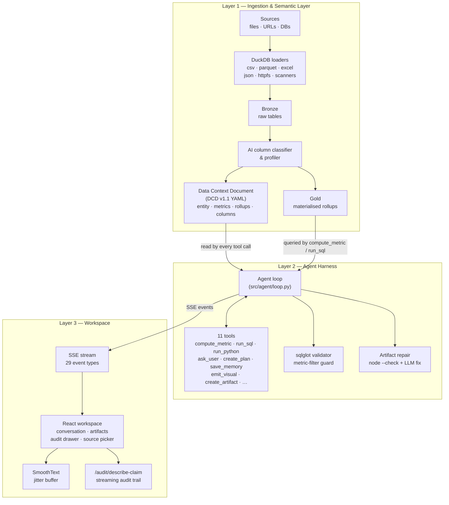
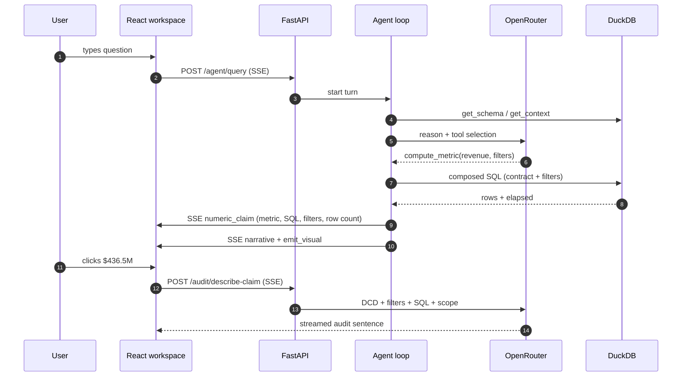

<p align="center">
  
</p>

<h1 align="center">Manthan</h1>

<p align="center">
  An autonomous data-analyst agent with a semantic layer.<br/>
  Every number it cites is traceable back to a governed definition.
</p>

<p align="center">
  <a href="https://www.python.org/downloads/"></a>
  <a href="https://react.dev/"></a>
  <a href="https://duckdb.org/"></a>
  <a href="https://fastapi.tiangolo.com/"></a>
  <a href="LICENSE"></a>
</p>

---

## What Manthan does

Point Manthan at any data source — a CSV, a Postgres table, an S3 bucket — and it does three things before you ever ask a question:

1. **Profiles every column** with an AI classifier (metric / dimension / temporal / identifier) and writes the answers into a **Data Context Document (DCD)** — a YAML semantic layer the agent reads before every query.
2. **Proposes governed metrics** (e.g. `revenue = SUM(subtotal) WHERE status='delivered'`) that become the agent's happy path: one named definition, one SQL expression, one source of truth.
3. **Pre-materialises rollups** (by day, by status, by region) so common slices don't re-scan the source.

Then when you ask a question, an agent loop runs against those primitives. Every number it cites carries a `numeric_claim` event with the metric slug, filters applied, SQL executed, and row count scanned — so clicking any figure opens an **audit trail** that streams back an LLM-written sentence grounded in the DCD:

> *"This is the Revenue metric (governed slug `revenue`) from the Orders entity. Per the contract it sums delivered-order subtotals where `status = 'delivered'`. For this answer it was further filtered to `State = 'California'`. Calculated from 4,820 of 12,300 rows from the Finance dataset (from `finance.csv`, ingested 18 Apr 2026)."*

The agent ships dashboards as sandboxed HTML artifacts. If one throws a runtime error, a bridge in the iframe postMessages the error out and the UI offers a one-click Retry that re-runs the original question with the failure context attached.

---

## Architecture



### Layer 1 — Ingestion &amp; Semantic Layer

Loaders under `src/ingestion/loaders/` land everything in DuckDB:

| Format / Source | Loader | Notes |
|---|---|---|
| CSV, TSV | `csv_loader.py` | tab-aware, null sentinels |
| Parquet | `parquet_loader.py` | columnar preserved |
| Excel `.xlsx` / `.xls` | `excel_loader.py` | multi-sheet |
| JSON | `json_loader.py` | auto-flattens nested objects |
| Multi-file bundle | `src/ingestion/relationships.py` | detects FKs by value containment |
| `https://` / `s3://` / `gs://` / `az://` | `cloud_loader.py` | DuckDB `httpfs` |
| Postgres, MySQL, SQLite | `db_loader.py` | DuckDB `ATTACH … READ_ONLY` |

After ingestion, `src/semantic/generator.py` runs the profiler, asks the user to clarify ambiguous columns, and writes a `DcdDataset` to disk. A later pass proposes `DcdMetric` contracts which the agent uses through the governed `compute_metric` path.

### Layer 2 — Agent harness

`src/agent/loop.py` runs a single `while` loop: LLM call → tool dispatch → observation → iterate. Eleven tools are registered in `src/agent/tools.py`:

| Tool | Purpose |
|---|---|
| `get_schema` / `get_context` | Serve the DCD (compact or full YAML) |
| `compute_metric` | **Governed happy path** — composes SQL from a named `DcdMetric` |
| `run_sql` | Read-only SQL against DuckDB for ad-hoc slices |
| `run_python` | Stateful sandbox (pandas, DuckDB, numpy) |
| `ask_user` | Blocking clarification with structured options |
| `create_plan` | Multi-step plan with approval gate |
| `save_memory` / `recall_memory` | Cross-session SQLite memory |
| `emit_visual` | Inline chart in the conversation stream |
| `create_artifact` | Sandboxed HTML dashboard in the side panel |

A `sqlglot`-based validator in `src/semantic/validator.py` rejects queries that reference undeclared tables/columns or that compute a named metric without its baked-in filter.

### Layer 3 — React workspace

`manthan-ui/src/` renders the SSE stream. Key components:

| Component | What it renders |
|---|---|
| `layout/MainWorkspace.tsx` | Switches between FirstOpen, DatasetProfile, ReadyToQuery, ProcessingWizard, ActiveWorkspace |
| `conversation/ConversationStream.tsx` | Agent thinking cards, narrative, ask-user, artifact cards |
| `render/shared/NarrativeBlock.tsx` | Markdown with click-to-audit numeric spans |
| `artifact/ArtifactPanel.tsx` | Iframe + runtime-error bridge + Retry button |
| `audit/CalculationDrawer.tsx` | Streaming audit trail with chip-styled slugs and filter predicates |
| `datasets/SourcePicker.tsx` | Files / Cloud URL / Database / Apps tabs |
| `datasets/ProcessingWizard.tsx` | Six-stage ingestion progress with clarification Q&amp;A |

All AI-generated text flows through `lib/smooth-text.ts` — a jitter-buffer engine that reveals tokens at 72–420 cps with grapheme-safe slicing, so bursty SSE chunks render as steady word-by-word reveal.

---

## Request flow



---

## Quick start

### Prerequisites

- Python **3.12+**
- Node **20+**
- An [OpenRouter](https://openrouter.ai) API key (free tier works)

### With Docker

```bash
git clone https://github.com/hitakshiA/Manthan.git
cd Manthan
cp .env.example .env                  # paste your OPENROUTER_API_KEY
docker compose up --build
```

Open `http://localhost:8000` — the Dockerfile builds the React bundle and serves it from FastAPI on a single port.

### Local dev (two processes, hot reload)

```bash
# --- backend ---
python -m venv .venv && source .venv/bin/activate
pip install -e ".[dev]"
uvicorn src.main:app --reload            # :8000

# --- frontend (new terminal) ---
cd manthan-ui
npm install
npm run dev                              # :5173 (Vite proxies /api → :8000)
```

Visit `http://localhost:5173`.

---

## Supported sources

| Tab | Wired | Status |
|---|---|---|
| **Files** | CSV · TSV · Parquet · Excel · JSON · multi-file bundles | ready |
| **Cloud URL** | `https://` · `s3://` · `gs://` · `az://` | ready |
| **Database** | Postgres · MySQL · SQLite | ready |
| **Apps** (SaaS) | Stripe · HubSpot · Salesforce · Shopify · Notion · Airtable · Google Ads · Meta Ads · GitHub · Slack | UI placeholder · `dlt` backend not wired |

Database form has client-side validation plus a raw-connection-string toggle for power users. MySQL connection strings auto-translate libpq-style params (`password`, `dbname`) to the DuckDB MySQL-scanner equivalents (`passwd`, `db`).

---

## Tech stack

| Layer | Choice | Why |
|---|---|---|
| API | FastAPI + uvicorn | SSE-first, async tool dispatch |
| Engine | DuckDB | single-process, columnar, great httpfs/scanner ecosystem |
| Semantic | Pydantic + YAML | typed DCD v1.1, versionable on disk |
| SQL guard | `sqlglot` | parses agent SQL against the DCD catalog |
| LLM | OpenRouter (model-agnostic) | same API across Anthropic / OpenAI / GLM / open models |
| Credentials | `cryptography.fernet` | envelope-encrypted vault for DB passwords |
| Frontend | React 19 + Vite + TypeScript | |
| UI | Tailwind CSS 4, Recharts, Lucide, Motion, Tegaki | |
| Brand icons | `simple-icons` (CC0) | Postgres / MySQL / Stripe / GitHub etc. |
| State | Zustand | slice-per-domain stores |
| Streaming | Server-Sent Events | one transport for agent + audit + pipeline progress |

All runtime deps are Apache 2.0 / MIT / BSD / PSF licensed.

---

## Project structure

```
manthanv2/
├── src/                           # Python backend — 87 files
│   ├── agent/                     # loop, tools, prompt, events, artifact-repair
│   ├── api/                       # 14 FastAPI routers
│   ├── semantic/                  # DCD schema, generator, validator, editor
│   ├── ingestion/
│   │   └── loaders/               # csv, tsv, parquet, excel, json, cloud, db
│   ├── profiling/                 # column classifier, interactive clarification
│   ├── materialization/           # rollup summariser, verified queries
│   ├── tools/                     # backing fns for compute_metric, run_sql, etc.
│   ├── sandbox/                   # Python subprocess REPL
│   ├── core/                      # config, state, LLM client, credentials vault
│   └── main.py                    # router mounts
│
├── manthan-ui/                    # React frontend
│   └── src/                       # 91 files
│       ├── components/
│       │   ├── layout/            # App shell, sidebar, status bar
│       │   ├── conversation/      # thinking cards, ask-user, activity
│       │   ├── workspace/         # QueryInput, ActivityFeed
│       │   ├── artifact/          # iframe panel + error bridge
│       │   ├── audit/             # CalculationDrawer
│       │   ├── datasets/          # SourcePicker, ConnectorIcon, ProcessingWizard
│       │   └── render/            # SimpleView · ModerateView · ComplexView
│       ├── hooks/                 # use-smooth-text, use-claim-description, use-send-query
│       ├── stores/                # agent · session · ui · dataset · processing
│       ├── api/                   # client, agent, audit, datasets, pipeline-progress
│       ├── lib/                   # SmoothText jitter buffer
│       └── types/
│
├── tests/                         # 46 test files · 136+ tests
│   ├── test_semantic/
│   ├── test_profiling/
│   ├── test_ingestion/
│   ├── test_materialization/
│   ├── test_tools/
│   ├── test_api/
│   └── test_core/
│
├── pyproject.toml                 # package metadata + deps
├── Dockerfile                     # multi-stage: Node build + Python serve
├── docker-compose.yml
├── fly.toml                       # Fly.io deploy config
├── .env.example
└── README.md
```

---

## API surface

Mounted in `src/main.py`:

| Router | Prefix | Key endpoints |
|---|---|---|
| `health.router` | `/health` | liveness |
| `datasets.router` | `/datasets` | `POST /upload`, `POST /upload-multi`, `POST /connect`, `POST /connect-url`, `POST /{id}/refresh`, `GET /`, `GET /{id}/schema`, `GET /{id}/context` |
| `tools.router` | `/tools` | `POST /sql`, `POST /python`, `POST /metric`, `POST /schema`, `POST /context` |
| `agent.router` | `/agent` | `POST /query` (SSE) |
| `audit.router` | `/audit` | `POST /describe-claim` (SSE) |
| `clarification.router` | `/clarification` | per-dataset clarification answers |
| `ask_user.router` | `/ask_user` | mid-turn user prompts |
| `plans.router` | `/plans` | plan creation + approval gate |
| `memory.router` | `/memory` | cross-session memory store |
| `status.router` | `/status` | pipeline progress SSE |
| `agent_tasks.router` | `/agent/tasks` | long-running task state |
| `subagents.router` | `/subagents` | parallel analysis spawns |
| `connections.router` | `/connections` | saved warehouse credentials |
| `tool_discovery.router` | `/tool-discovery` | tool registry |

### SSE event types

The agent emits **29 distinct event types** over `/agent/query`. Frontend renderers in `manthan-ui/src/components/conversation/` dispatch on the `type` field:

```
session_start · thinking · deciding · progress
discovering_tables · tables_found · loading_schema · checking_memory · memory_found
tool_start · tool_complete · tool_error
sql_result · numeric_claim · narrative · inline_visual
artifact_created · artifact_updated · repairing_artifact
plan_created · plan_pending · plan_approved
subagent_spawned · subagent_complete
ask_user · waiting_for_user · user_answered
turn_complete · done · error
```

---

## Core concepts

### The DCD (Data Context Document)

One YAML file per dataset. Schema defined in `src/semantic/schema.py`:

- **`DcdDataset`** — source metadata + rows/columns/timing
- **`DcdEntity`** — stable business wrapper (`slug`, `name`, `physical_table`) with `metrics` and `rollups`. Slug is immutable across re-ingests; the `physical_table` pointer rotates atomically.
- **`DcdMetric`** — governed contract: `slug`, `label`, `expression`, `filter` (always applied), `unit`, `aggregation_semantics` (`additive` / `ratio_unsafe` / `non_additive`), `default_grain`, `valid_dimensions`, `synonyms`
- **`DcdRollup`** — materialised aggregate pointer: `slug`, `physical_table`, `grain`, `dimensions`
- **`DcdColumn`** — `role`, `label`, `description`, `aggregation`, `stats`, `sample_values`, `synonyms`, `classification_confidence`, `pii`

### The `numeric_claim` event

Every number the agent cites carries structured lineage:

```json
{
  "type": "numeric_claim",
  "value": 706532.75,
  "formatted": "$706K",
  "formatted_variants": ["$706K", "$0.7M", "706,532"],
  "label": "Revenue",
  "description": "Sum of subtotal for delivered orders",
  "entity": "orders",
  "metric_ref": "revenue",
  "filters_applied": ["status = 'delivered'"],
  "dimensions": [],
  "grain": null,
  "sql": "SELECT SUM(subtotal) FROM gold_orders WHERE status='delivered'",
  "row_count_scanned": 4820,
  "run_id": "run_ab12"
}
```

Clicking a number in the conversation stream opens the audit drawer, which calls `POST /audit/describe-claim` — an SSE endpoint that reads the DCD metric contract, the referenced columns, the dataset's total row count, and the source provenance, then streams a grounded audit sentence. If the model leaks its drafting process as content, a `_looks_like_draft_leak` detector triggers an extraction pass that rescues the clean paragraph; if that fails, the drawer silently falls back to a regex-built summary.

### Artifact repair

When `create_artifact` returns HTML, a pipeline in `src/agent/artifact_repair.py`:

1. Extracts inline `<script>` bodies.
2. Validates each via `node --check` subprocess.
3. On parse error, fires a focused single-shot LLM call with the broken HTML + Node error message, validates again, and emits the fixed version.

Runtime errors (Chart.js misconfig, undefined globals) that static validation can't catch are surfaced via an error bridge injected into the iframe — it `postMessage`s errors to the parent, where `ArtifactPanel` shows a **"Your query failed"** banner with a **Retry** button. Retry drops the failed turn's blocks from the transcript and re-fires the original question with the failure reason appended so the agent picks a different approach.

---

## Development

### Backend

```bash
pip install -e ".[dev]"
ruff format src/ tests/
ruff check src/ tests/
pytest tests/ -q                         # 136+ tests
```

### Frontend

```bash
cd manthan-ui
npm run typecheck
npm run lint
npm run build
```

### Environment variables

All read via `pydantic-settings` from `.env`. See `.env.example` for the full set. Required at minimum:

```env
OPENROUTER_API_KEY=sk-or-...
OPENROUTER_MODEL=openai/gpt-oss-120b:free
OPENROUTER_FALLBACK_MODELS=["qwen/qwen3-next-80b-a3b-instruct:free","nvidia/nemotron-3-nano-30b-a3b:free"]
DATA_DIRECTORY=./data
```

DuckDB tuning (memory, threads, temp dir) and server binding (host, port) are all env-overridable.

---

## Deployment

- **Docker Compose:** `docker compose up --build` — production-ish single-container.
- **Fly.io:** `fly deploy` — `fly.toml` is checked in.
- **Anywhere else:** the Dockerfile is a standard multi-stage build (Node 22 for the Vite bundle → Python 3.13 runtime).

For production, mount a persistent volume at `/app/data` so DCDs, DuckDB state, and the credentials vault survive restarts.

---

## License

[Apache 2.0](LICENSE).
