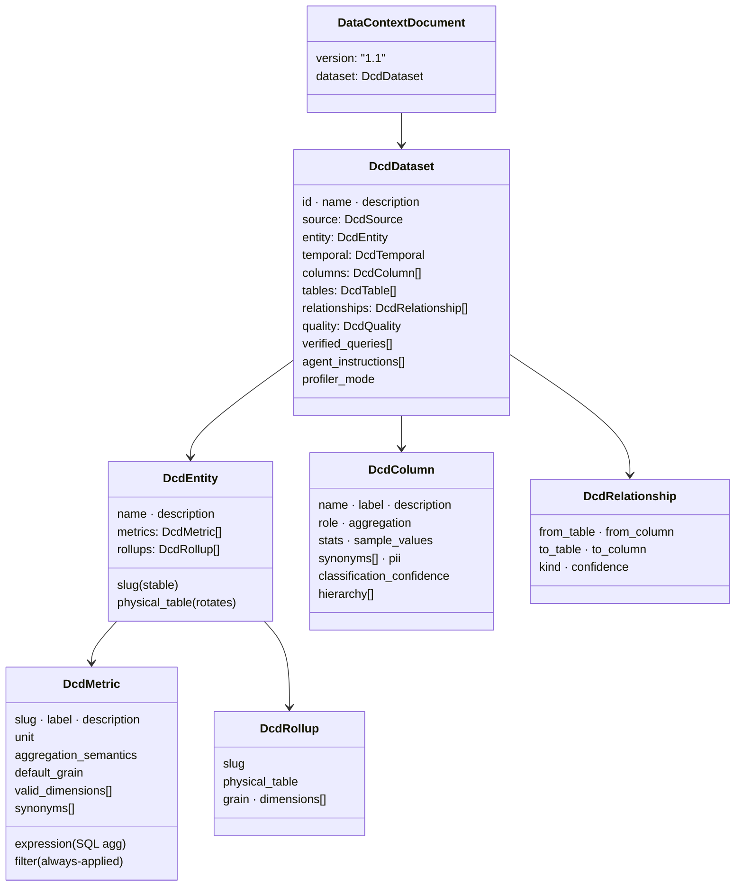
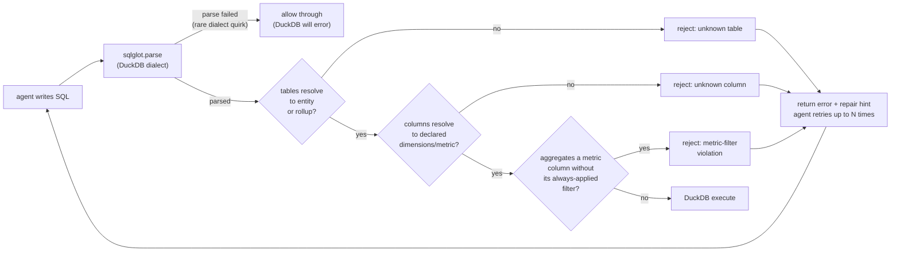
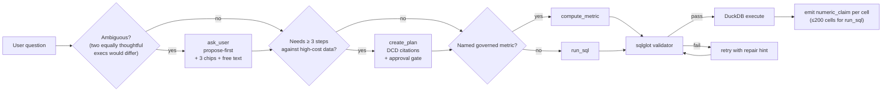
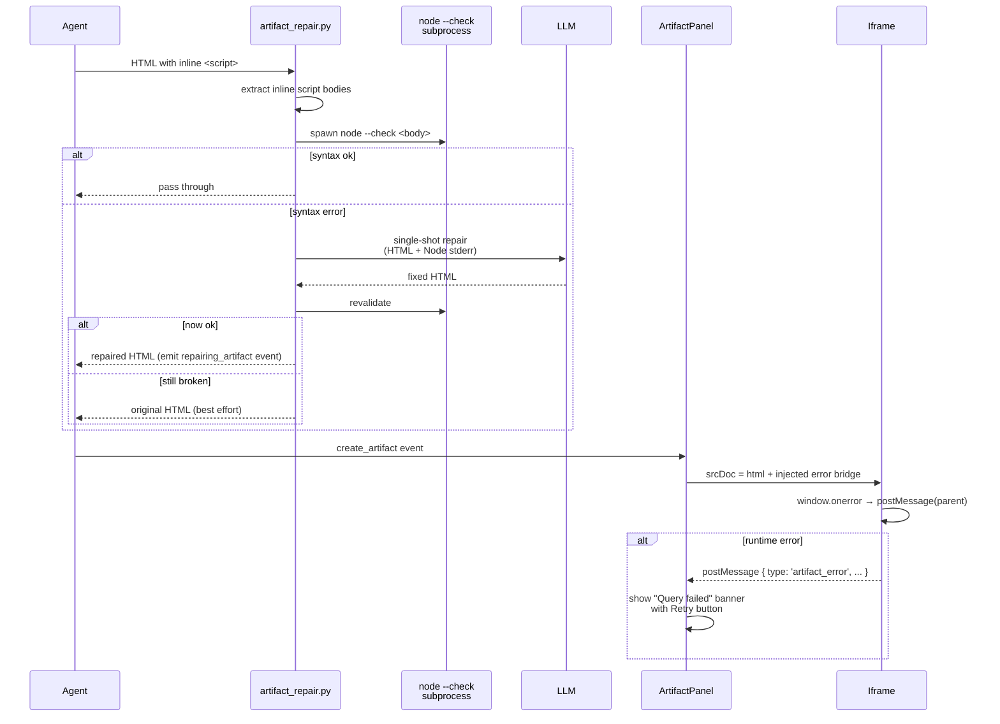
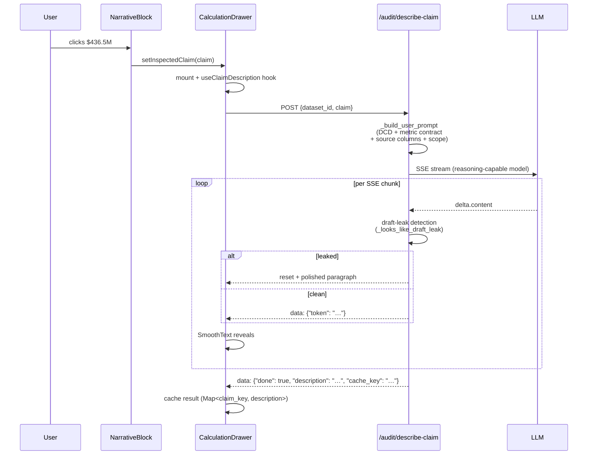
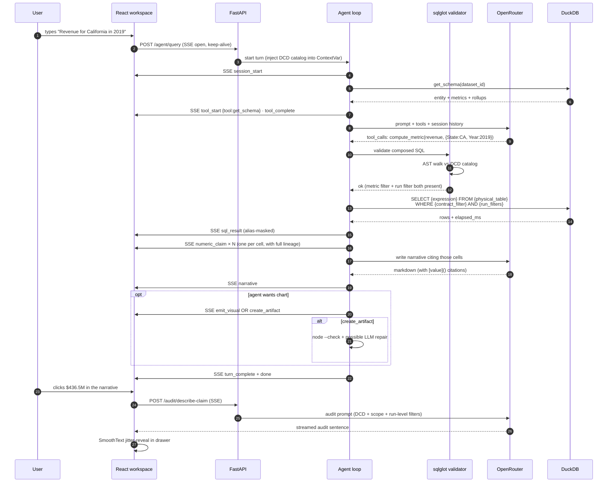

<p align="center">
  
</p>

<h1 align="center">Manthan</h1>

<p align="center">
  A business-intelligence agent with a governed semantic layer, a pre-execution SQL validator, and an audit-first workspace.<br/>
  One self-hostable Apache-2.0 codebase. No vendor lock-in.
</p>

<p align="center">
  <a href="https://www.python.org/downloads/"></a>
  <a href="https://react.dev/"></a>
  <a href="https://duckdb.org/"></a>
  <a href="https://fastapi.tiangolo.com/"></a>
  <a href="LICENSE"></a>
</p>

---

## Table of contents

- [TL;DR for engineers](#tldr-for-engineers)
- [Why this isn't another text-to-SQL app](#why-this-isnt-another-text-to-sql-app)
- [Architecture](#architecture)
- [Layer 1 — the semantic layer](#layer-1--the-semantic-layer)
- [Layer 2 — the agent harness](#layer-2--the-agent-harness)
- [Layer 3 — the workspace](#layer-3--the-workspace)
- [Request lifecycle](#request-lifecycle)
- [Event model](#event-model)
- [Engineering invariants](#engineering-invariants)
- [Competitive landscape](#competitive-landscape)
- [Getting started](#getting-started)
- [Supported sources](#supported-sources)
- [API reference](#api-reference)
- [Project structure](#project-structure)
- [Development](#development)
- [Deployment](#deployment)
- [License](#license)

---

## TL;DR for engineers

If you've looked at 50 "talk to your data" tools this quarter, they tend to fall into one of three buckets:

1. **Thin wrappers** — stuff the schema into a prompt, ask an LLM for SQL, execute, render.
2. **Vendor-locked AI analytics** — Snowflake Cortex Analyst, Databricks Genie, Looker Gemini. All solid, all require you to live inside the platform.
3. **Semantic-layer SDKs without a workspace** — dbt Semantic Layer, Cube, AtScale. Great governance, you still build the UI and agent loop.

**Manthan is the fourth option: a self-hosted, Apache-2.0, BI-native agent that bundles all three layers — semantic governance, a validated agent loop, and an audit-first React workspace — in one repo you can fork and run anywhere.**

The technical bets that make this work:

- **DCD v1.1** — a Pydantic + YAML semantic layer where `DcdMetric` carries an always-applied filter, `aggregation_semantics` (`additive` / `ratio_unsafe` / `non_additive`), a `valid_dimensions` whitelist, and a default grain. The agent's governed happy path (`compute_metric`) composes SQL from this contract deterministically — the LLM never writes `SUM(subtotal)` for "revenue" if the metric carries `status='delivered'`.
- **sqlglot pre-execution validator** — every `run_sql` call is parsed into an AST against the DCD catalog before DuckDB ever sees it. Undeclared tables, undeclared columns, and metric-filter violations are rejected at parse time with a repair hint; the agent retries without a warehouse round-trip.
- **ContextVar-scoped alias catalog** — physical table names (`gold_orders_16b49dbd39_by_status`) are rewritten to entity slugs through a per-request `ContextVar`-held `AliasCatalog`. Thread-safe, O(1) per rewrite, concurrent requests can't cross-contaminate.
- **Structured `numeric_claim` auto-emission** — every cell of every `compute_metric` result (and ≤200-cell `run_sql` results) emits a typed SSE event carrying `value`, `formatted`, `label`, `metric_ref`, `filters_applied`, `dimensions`, `grain`, `sql`, `row_count_scanned`, and `description`. The drawer-open audit trail streams over a second SSE endpoint grounded in that lineage.
- **`node --check` + single-shot LLM repair for artifact validation** — inline `<script>` bodies are extracted and validated via a Node subprocess; parse errors fire one focused repair call before the artifact ships. Runtime errors (Chart.js config throws) are captured via an injected `postMessage` error bridge and routed into a one-click **Retry query** flow that replays the turn with the failure reason appended.
- **rAF jitter-buffer (`SmoothText`)** — every AI-text surface renders through a frame-rate-invariant animation-budget engine (72–420 cps adaptive, grapheme-safe via `Intl.Segmenter`). Bursty SSE chunks feel like steady typing across 60Hz and 240Hz displays.
- **Fernet envelope-encrypted credential vault** — per-tenant data keys wrapped under a process-level master key. CMK rotation is a re-wrap. No plaintext connection strings on disk, ever.
- **Refresh-in-place** — re-ingesting rotates the `physical_table` pointer atomically while the entity `slug`, user-authored metric labels, column renames, synonyms, and PII flags survive.

The rest of this doc is the full tour.

---

## Why this isn't another text-to-SQL app

The AI-analytics industry converged on a single conclusion in 2026: **raw text-to-SQL against enterprise schemas doesn't work**. The evidence:

| Benchmark / Study (2026) | Text-to-SQL accuracy | Semantic-layer accuracy | Source |
|---|---|---|---|
| Spider 1.0 (10-table demos) | ~90% | — | dbt Labs |
| Spider 2.0 (real Snowflake/BigQuery) | **21–29%** | — | Salesforce, VLDB |
| dbt Labs Insurance benchmark | 90.0% (Sonnet 4.6) | **98.2%** — 0% false results on out-of-scope | dbt |
| dbt Labs Insurance benchmark | 84.1% (GPT-5.3 Codex) | **100.0%** on SL-covered queries | dbt |
| Uber production (internal) | ~50% table-match rate | — | Uber eng |
| Typical enterprise warehouse (no SL) | **10–31%** | — | Omni, Tellius |
| 11-table enterprise simulation | 10% | — | VLDB 2026 case study |

The failure mode isn't syntax errors. It's **silent wrong results**: an analysis of 4,602 failed queries found **81.2% were schema-level errors** (wrong columns, fan-out traps, business-term ambiguity), only **18.8% were syntax errors**. Text-to-SQL returns plausible SQL that means the wrong thing and nobody flags it.

Critically, dbt Labs' 2026 benchmark showed the semantic-layer approach has a property text-to-SQL can't match: **0% false answers on out-of-scope questions**. It either returns the right number or explicitly says "I can't answer that." A text-to-SQL agent will invent.

The industry response: Google Cloud Looker (LookML + Gemini), Snowflake Cortex Analyst (YAML semantic model + API), Databricks Genie (Unity Catalog + MCP), AtScale (universal SML via MCP), dbt Semantic Layer (MetricFlow). All good, all betting on semantic layers as the prerequisite for trusted AI-on-data.

**What Manthan adds to that conversation:**

1. A semantic layer *plus* the agent loop *plus* the BI workspace, in one codebase you can run on your laptop.
2. Pre-execution SQL validation — most vendors either trust the model or validate at runtime after a warehouse round-trip.
3. An audit trail that fires on every number, not just the final answer.
4. Self-hostable, no platform lock-in, Apache 2.0.

---

## Architecture

Three layers, with the DCD as the contract between them.


The DCD is the compile-time contract. The agent loop is the runtime. The React workspace is the audit surface. Each layer is independently replaceable — the DCD schema is vendor-neutral YAML; the agent loop is model-neutral (OpenRouter, any provider); the frontend talks to the backend over plain JSON + SSE.

---

## Layer 1 — the semantic layer

**What it delivers for the business:** a single source of truth for every metric, dimension, and relationship. No more "why does Revenue look different in this dashboard" — the DCD *is* the answer.

**What it delivers technically:** a typed Pydantic contract that every tool call reads before it runs, versioned on disk, editable by humans, deterministic for machines.

### The DCD (Data Context Document) v1.1

One YAML file per dataset, validated against [`src/semantic/schema.py`](src/semantic/schema.py). Simplified shape:



### The `DcdMetric` contract

This is the primitive that makes the governed happy path work. Each field is a guard the agent cannot violate without tripping the validator:

| Field | Purpose | Validator enforcement |
|---|---|---|
| `expression` | SQL aggregation, e.g. `SUM(subtotal)` or `SUM(subtotal) / COUNT(DISTINCT order_id)` | Referenced columns must be declared in the entity |
| `filter` | **Always-applied** predicate (e.g. `status = 'delivered'`) | Any query that aggregates the metric's columns without this filter is a **metric-filter violation** — pre-exec rejection |
| `aggregation_semantics` | `additive` \| `ratio_unsafe` \| `non_additive` | Prompt doctrine: `ratio_unsafe` can't be SUMmed across slices (ratios re-compute from num/denom) |
| `valid_dimensions` | Whitelist of safe slice dimensions | Slicing by anything outside the whitelist is flagged |
| `default_grain` | `daily` / `weekly` / `monthly` / `quarterly` / `yearly` | Drives the agent's default time-axis choice |
| `synonyms` | Natural-language aliases (`sales` → `revenue`) | The schema-tool output folds these into the prompt so the agent recognizes user phrasing |

### Ingestion pipeline

Bronze → Silver → Gold, orchestrated by [`src/api/pipeline.py`](src/api/pipeline.py).

```
upload → scan → profile → classify → enrich → materialize
```

| Stage | What happens | Relevant module |
|---|---|---|
| **Bronze** | Raw data lands in DuckDB as `raw_<uuid>`. Multi-file bundles go through FK detection by value containment | `src/ingestion/loaders/*` · `src/ingestion/relationships.py` |
| **Silver** | Column-level stats (min/max/mean/stddev/p25/p75), cardinality, sample values, nullability, completeness | `src/profiling/*` |
| **Classify** | AI classifier assigns `role` (metric / dimension / temporal / identifier / auxiliary), `label`, `description`, `aggregation`, `classification_confidence`. Fails-safe to a deterministic heuristic if no LLM is available | `src/profiling/classifier.py` |
| **Enrich** | Low-confidence columns surface in the blocking clarification panel; metric proposals are generated from dimension/measure pairs | `src/profiling/clarification.py` |
| **Gold** | Rollup tables materialized (by-status, by-day, etc.); verified queries generated from the DCD schema (not LLM — deterministic); DCD written to disk; entity handed off to the agent | `src/materialization/*` |

### Ingestion loaders

All eight loaders return a `LoadResult` with the same shape. Wire format is DuckDB either way.

| Format / source | File | DuckDB path |
|---|---|---|
| CSV, TSV | `csv_loader.py` | `read_csv_auto` |
| Parquet | `parquet_loader.py` | `read_parquet` |
| Excel (.xlsx / .xls) | `excel_loader.py` | `openpyxl` → DuckDB insert, multi-sheet |
| JSON | `json_loader.py` | `read_json_auto` with auto-flatten |
| `https://` / `s3://` / `gs://` / `az://` | `cloud_loader.py` | `INSTALL httpfs; LOAD httpfs; CREATE SECRET …` |
| Postgres | `db_loader.py` | `ATTACH '…' AS src (TYPE POSTGRES, READ_ONLY)` |
| MySQL | `db_loader.py` | `ATTACH '…' AS src (TYPE MYSQL, READ_ONLY)` — libpq-style param names auto-translated to `passwd`/`db` |
| SQLite | `db_loader.py` | `ATTACH '…' AS src (TYPE SQLITE, READ_ONLY)` |

All DB attaches are `READ_ONLY`. Connection strings never persist as plaintext — they're pulled from the [credential vault](#credential-vault) at attach time.

### DCD versioning

Every edit to the DCD appends a full snapshot (not a diff) to `data/<dataset_id>/dcd_history.jsonl`. Full snapshots mean point-in-time replay is trivial — no diff library required. A `GET /datasets/{id}/history` endpoint streams the log; the History drawer in the UI renders it.

### Credential vault

`src/core/credentials.py` implements a Fernet envelope-encrypted vault:

- **Per-tenant data key (DK)** encrypted under a process-level **master key (MK)** loaded from `MANTHAN_VAULT_MASTER_KEY`.
- CMK rotation = re-wrap the DK, not re-encrypt the credentials. O(1) per rotation.
- SQLite WAL for the key store. Embedded, no external service.
- Credentials are decrypted only inside the `load_from_database` call at `ATTACH` time, used once, and the plaintext never touches disk.

---

## Layer 2 — the agent harness

**What it delivers for the business:** an analyst that reasons about the question, plans before it acts, asks when unsure, and produces structured output — dashboards, reports, KPI cards — not just text.

**What it delivers technically:** a ReAct-style while loop with 11 typed tools, three decision gates, a sqlglot-based pre-execution validator, an artifact repair pipeline, and 29 distinct SSE event types.

### The loop

`src/agent/loop.py`. Pseudocode:

```python
async def run_stream(user_message: str) -> AsyncIterator[Event]:
    messages = [system_prompt, *session_history, user_message]
    nudged_for_empty = False
    while True:
        response = await llm.generate(messages, tools=TOOL_DEFINITIONS)
        if response.tool_calls:
            for call in response.tool_calls:
                yield ToolStartEvent(call)
                result = await dispatch(call)           # validator + execute
                yield ToolCompleteEvent(result)
                auto_emit_numeric_claims(result)         # per-cell lineage
            messages.append(response)
            continue
        if _content_cites_numbers(response.content) and no_tools_ran_this_turn:
            # Ground-truth guard: numbers must come from a tool call this turn
            if not nudged_for_empty:
                nudged_for_empty = True
                messages.append(nudge_for_verification())
                continue
        yield NarrativeEvent(response.content)
        break
```

### The 11 tools

Defined in [`src/agent/tools.py`](src/agent/tools.py). Selection is governed by prompt doctrine; `compute_metric` is the **governed happy path**, `run_sql` is the fallback.

| Tool | Backed by | Selection rule |
|---|---|---|
| `get_schema` | `src/tools/schema_tool.py` | Default first call on any new turn; returns a compact entity summary |
| `get_context` | `src/tools/context_tool.py` | When the agent needs the full DCD (rich contracts, relationships) |
| **`compute_metric`** | `src/tools/metric_tool.py` | **For any named governed metric.** Composes SQL deterministically from `DcdMetric`: `SELECT {expression} FROM {physical_table} WHERE {contract_filter} AND {run_filter} GROUP BY {dims}` |
| `run_sql` | `src/api/tools.py::execute_sql` | Ad-hoc slices not covered by a metric. Goes through the sqlglot validator first |
| `run_python` | `src/sandbox/*` | Stateful subprocess REPL; pandas, DuckDB, numpy, sklearn, matplotlib. For regressions, clustering, forecasts |
| `ask_user` | `src/api/ask_user.py` | Mid-turn blocking clarification with chip options + free-text redirect |
| `create_plan` | `src/api/plans.py` | Multi-step plans ≥3 tool calls; 30s auto-approve gate |
| `save_memory` / `recall_memory` | `src/api/memory.py` (SQLite WAL) | Cross-session findings persist; recalled at the start of every new turn |
| `emit_visual` | `src/agent/loop.py` | Inline chart in the conversation stream (single-chart answers) |
| `create_artifact` | `src/agent/artifact_repair.py` | Sandboxed HTML dashboard in the side panel; goes through the repair pipeline |

### The sqlglot pre-execution validator

`src/semantic/validator.py`. Every `run_sql` call is parsed into an AST against the DCD catalog before DuckDB sees it.



This catches at parse time what Cortex Analyst, Looker-Gemini, and dbt Semantic Layer only catch *after* a warehouse round-trip (or worse, never — Cortex Analyst's own docs acknowledge that an undeclared relationship infers join paths from column names and can silently return wrong rows). We'd rather tell the agent "you cited an undeclared column" than return a plausible wrong answer.

### Decision gates



### Prompt doctrine

`src/agent/prompt.py` encodes four non-negotiable rules:

1. **Ground-truth rule** — every specific number cited must come from a tool call executed *in this turn*. No prior-session memory, no training-data guesses. Enforced post-hoc by `_content_cites_numbers` regex + `nudged_for_empty` retry.
2. **Ask-when-unsure default** — "when two equally thoughtful executives would disagree on what the question means, stop and `ask_user`."
3. **Governed-metric-first doctrine** — "for any named business metric, prefer `compute_metric` over `run_sql`." The schema-tool output surfaces metrics first, columns second.
4. **Physical-name ban** — "never quote `gold_xxx` table names or dotted column names like `Totals.Revenue` in prose; use DCD labels." Enforced at emission time by the [alias catalog](#alias-catalog).

### Artifact repair pipeline

Artifacts are HTML files with inline `<script>` bodies. The agent writes them; Chart.js / D3 / vanilla JS renders them in a sandboxed iframe. Two failure modes, two defenses:



Static syntax catches `const x = ;` and missing braces. Runtime errors (Chart.js config throws at `new Chart(...)`, undefined globals, missing DOM elements) get caught by the injected bridge. Either way the user gets a specific, actionable failure message and a **Retry query** button that re-fires the turn with the failure reason appended.

### Alias catalog

`src/agent/aliasing.py`. Physical names like `gold_orders_16b49dbd39_by_status` never reach the exec-facing UI. Implementation:

- Catalog is built once per request from the current DCD: `{physical_name → entity_slug}`.
- Stored in a `ContextVar` so concurrent requests don't collide and the propagation is automatic across async tool calls.
- A compiled regex union (longest-first to prioritize `_by_status` over the base table) rewrites every `sql_result` preview, every `tool_start` args_preview, every narrative line before it leaves the backend as an SSE event.
- Unknown names pass through untouched — no hallucinated rewrites.

```python
# src/agent/aliasing.py (simplified)
_current_catalog: ContextVar[AliasCatalog | None] = ContextVar("alias_catalog", default=None)

def set_alias_catalog(catalog: AliasCatalog) -> Token:
    return _current_catalog.set(catalog)

def mask(text: str) -> str:
    cat = _current_catalog.get()
    return cat.mask(text) if cat else text
```

Every event factory in `src/agent/events.py` runs its fields through `mask()` before serializing. The agent literally cannot leak a physical table name in prose — the transport layer strips them.

### Cross-session memory & session history

`src/agent/session_history.py` — message history per session with a 200-message cap. Invariant preserved: every `tool` role message is always preceded by the `assistant` message whose `tool_calls` it satisfies. Trimming at the cap is assistant-pair-aware so you never orphan a tool result.

`src/api/memory.py` — cross-session SQLite WAL store. `save_memory` persists a finding; `recall_memory` is auto-called at the start of every new turn on a dataset the user has seen before.

---

## Layer 3 — the workspace

**What it delivers for the business:** a workspace that makes trust visible. Click any number, see the audit trail. Drop a CSV, watch six stages of ingestion stream live. Have a dashboard throw a JS error, get a clear failure banner and a one-click retry.

**What it delivers technically:** React 19 + Vite + TypeScript + Tailwind 4 + Zustand + Recharts. Every AI-text surface goes through a rAF jitter buffer. Audit is a second SSE endpoint. Artifacts are iframe-sandboxed with a postMessage error bridge.

### Component map

| Path | Renders |
|---|---|
| `layout/MainWorkspace.tsx` | Top-level router: `FirstOpen / DatasetProfile / ProcessingWizard / ReadyToQuery / ActiveWorkspace` |
| `layout/Sidebar.tsx` | Home / Datasets / New chat / Upload rail |
| `datasets/SourcePicker.tsx` | Four-tab ingest modal (Files / Cloud URL / Database / Apps) with form-mode + raw-string toggle |
| `datasets/ConnectorIcon.tsx` | Brand SVGs via `simple-icons` + monogram fallbacks for takedown-removed brands |
| `datasets/ProcessingWizard.tsx` | Six-stage ingest progress with Lottie animations + embedded clarification panel |
| `conversation/ConversationStream.tsx` | SSE-event-driven activity feed |
| `conversation/ThinkingGroup.tsx` | Collapsible card grouping `tool_start/tool_complete` pairs; reveals the source code the agent wrote |
| `conversation/AskUserBlock.tsx` | Propose-first clarification card with redirect chips |
| `render/shared/NarrativeBlock.tsx` | Markdown renderer with click-to-audit numeric wrapping via `claim:N` URL scheme |
| `artifact/ArtifactPanel.tsx` | Iframe + injected error bridge + Retry banner |
| `audit/CalculationDrawer.tsx` | Streaming audit drawer with backtick-chip styling |
| `audit/HistoryDrawer.tsx` | DCD change log viewer |
| `render/{SimpleView,ModerateView,ComplexView}.tsx` | `render_spec.json` dispatcher for KPI cards / dashboards / multi-page reports |

### State architecture

Zustand stores, sliced by concern:

| Store | Responsibility |
|---|---|
| `agent-store.ts` | Conversation blocks, SSE events, thinking buffer, numeric claims, inspected claim, repairing-artifact banner |
| `session-store.ts` | Current session id, active dataset id, query history |
| `ui-store.ts` | Artifact panel open/fullscreen, expanded inline visual, source picker, landing view, analyze mode |
| `dataset-store.ts` | Cached `DatasetSummary[]` + prefetch queue |
| `processing-store.ts` | In-flight ingest progress (multi-dataset support) |

No Redux, no Context overhead. Each store is ~100 LOC.

### The SmoothText engine

`manthan-ui/src/lib/smooth-text.ts`. Every AI-generated text surface flows through this hook:

```ts
const { visibleText, isAnimating } = useSmoothText(fullText, {
  streamKey,           // identity — changing it resets the cursor
  isStreaming,         // when false + buffer small, flush immediately
});
```

Implementation sketch:

- rAF loop, not setInterval (frame-rate invariant).
- Fractional character budget accrues per tick at an adaptive rate (72 cps baseline, up to 420 cps when backlog > 180 chars).
- `MAX_VISUAL_LAG = 120` chars — if the cursor lags more than that, snap forward.
- Grapheme-safe slicing via `Intl.Segmenter` so emoji and combining marks don't split mid-animation.
- When `isStreaming` flips false and the remaining buffer is < 48 chars, flush instantly so the user isn't left watching a tail animation.

Borrows its jitter-buffer approach from coder/coder's `SmoothText` and Convex's `useSmoothText`, blended into one self-contained TS file. ~180 LOC.

### The audit drawer

Click any number in the conversation. `NarrativeBlock.tsx` wraps every numeric span in a `[value](claim:N)` markdown link; the custom `a` renderer dispatches to the audit drawer via `setInspectedClaim`. `CalculationDrawer.tsx` opens, fires `POST /audit/describe-claim` (SSE), and streams a DCD-grounded audit sentence:



Draft-leak detection addresses a real failure mode with reasoning-capable models (GLM :exacto, in particular): they sometimes emit their planning dialogue (`**Drafting the sentences:**`, `*Sentence 1:*`, etc.) as *content* instead of *reasoning*. `_looks_like_draft_leak` pattern-matches against a marker set; on detection, `_extract_polished_paragraph` rescues the clean paragraph buried inside; if that fails, the drawer silently falls back to the regex-built summary. Either way the user never sees the mess.

### Artifact runtime error bridge

Injected into every artifact iframe's `srcDoc`:

```js
// src/components/artifact/ArtifactPanel.tsx
const ARTIFACT_ERROR_BRIDGE = `
<script>
(function() {
  window.addEventListener('error', (e) => {
    parent.postMessage({
      __manthan_artifact: true,
      kind: 'runtime_error',
      payload: { message: e.message, source: e.filename, line: e.lineno, … }
    }, '*');
  });
  window.addEventListener('unhandledrejection', (e) => { … });
})();
</script>
`;
```

The parent `ArtifactPanel` listens for these messages and toggles a red banner with the error text + the original user question + a **Retry query** button wired to `useRetryLastQuery`. Retry drops the failed turn's blocks (`truncateBlocksFrom`) and re-fires the turn with `(Retry — the previous attempt failed with: <error>. Please take a different approach.)` appended. The agent sees the failure reason and typically picks a different chart library or config.

### Render modes (`render_spec.json`)

Dashboards aren't monolithic HTML. The agent writes a `render_spec.json` file to the artifact output directory; the frontend dispatches to one of three renderers:

| Mode | When | Renderer |
|---|---|---|
| **Simple** | One KPI + one chart answer | `SimpleView.tsx` — Recharts inline |
| **Moderate** | Multi-section dashboard (3–6 charts + narrative) | `ModerateView.tsx` — Recharts grid |
| **Complex** | Multi-page analytical report with exec summary + findings + pages | `ComplexView.tsx` — paginated navigable |

The agent picks the mode based on answer complexity; the `render_spec` is a typed JSON contract, not free-form HTML.

---

## Request lifecycle

Full turn, end-to-end. This is what a senior engineer sees when they open DevTools.



---

## Event model

Every state transition in the agent loop emits a typed SSE event. The frontend dispatches on `type`:

```
session_start · thinking · deciding · progress · narrative
discovering_tables · tables_found · loading_schema · checking_memory · memory_found
tool_start · tool_complete · tool_error
sql_result · numeric_claim · inline_visual
artifact_created · artifact_updated · repairing_artifact
ask_user · waiting_for_user · user_answered
plan_created · plan_pending · plan_approved
subagent_spawned · subagent_complete
turn_complete · done · error
```

29 distinct types, structured, versioned. Every event goes through the alias-masking pass before serialization.

### The `numeric_claim` event

The anchor of the audit system. Emitted per cell for `compute_metric` results (always) and per cell for `run_sql` results (capped at 200 cells — beyond that the aggregate renders but individual cells don't get drill-downs).

```json
{
  "type": "numeric_claim",
  "value": 706532.75,
  "formatted": "$706K",
  "formatted_variants": ["$706K", "$0.7M", "706,532"],
  "label": "Revenue",
  "description": "Sum of subtotal for delivered orders",
  "entity": "orders",
  "metric_ref": "revenue",
  "filters_applied": ["status = 'delivered'"],
  "dimensions": [],
  "grain": null,
  "sql": "SELECT SUM(subtotal) FROM gold_orders WHERE status='delivered'",
  "row_count_scanned": 4820,
  "run_id": "run_ab12",
  "unit": "USD"
}
```

- `formatted_variants` so the frontend's click-to-audit wrap matches `$706K` / `$0.7M` / `706,532` equally without re-parsing.
- `description` is regex-built at emission time as a fast-path fallback; the audit drawer replaces it with an LLM-grounded sentence when opened.
- `row_count_scanned` lets the audit footer cite "21 of 1,051 rows (2%)" instead of just "21 rows."
- `run_id` correlates with server logs for debugging.

---

## Engineering invariants

The non-obvious decisions and the failure modes they prevent. This section is for the engineer who wants to understand what's actually load-bearing.

### 1. Governed metrics at compile time, not runtime

`compute_metric` composes SQL from the `DcdMetric` contract deterministically. The LLM names a metric; the backend writes the SQL. There is no path where the LLM can write `SUM(subtotal)` for "revenue" without the `status='delivered'` filter — the validator rejects it at parse time.

Contrast: Cortex Analyst and Looker-Gemini ask the LLM to write SQL informed by the semantic model, then hope it picked the right measures. Works well most of the time. Ours *can't* fail this way by construction.

### 2. Pre-execution AST validation

`src/semantic/validator.py` uses sqlglot to parse every `run_sql` call into an AST, walks it against the DCD catalog, and rejects undeclared tables, undeclared columns, and metric-filter violations before DuckDB ever sees the query. Saves a warehouse round-trip on the failure path and gives the agent a specific repair hint.

Parser failures are non-fatal — DuckDB dialect quirks fall through to runtime so real syntax errors still surface; we don't want the validator to be an overly-strict compile-error machine.

### 3. ContextVar-scoped alias catalog

Physical names never reach the UI. Implementation uses `ContextVar` so the catalog propagates automatically across async tool dispatch without thread-safety hazards. Rewrites are O(1) per event via a compiled regex union.

### 4. Artifact double-validation

`node --check` catches JS syntax errors; the postMessage error bridge catches runtime errors. Two distinct failure modes, two distinct defenses. Single-shot LLM repair, bounded latency — no iterative loops that can runaway. Ship-original fallback on repair failure means the dashboard never fully vanishes.

### 5. Ground-truth rule enforcement

`_content_cites_numbers` regex detects currency / percentage / comma-grouped integer tokens in agent prose. If the agent emits those without running a tool in the current turn, `nudged_for_empty` flag fires one retry with "produce these numbers via a tool call" appended. Prevents the single most common failure mode in production LLM deployments — the model confidently quoting numbers from training data.

### 6. Refresh-in-place preserves human edits

The entity wrapper (`DcdEntity`) carries stable `slug` + `name` + `description` + user-authored metric labels + column renames + PII flags. On refresh, `physical_table` rotates atomically; everything else is preserved via a preserve-customizations diff in `src/semantic/generator.py`. Without this, every refresh would wipe hours of classification-wizard work.

### 7. Full-snapshot DCD history

Append-only jsonl with full snapshots, not diffs. Point-in-time replay trivial. "What did Revenue mean on March 15?" is a simple line lookup. No diff library, no git dependency, no merge semantics.

### 8. rAF jitter buffer for streaming text

Frame-rate invariant (same behavior on 60Hz and 240Hz displays). Grapheme-safe slicing prevents emoji splitting. Clean flush on stream end — no tail animation after the agent is done. Decoupled from SSE chunk cadence so bursty tokens still reveal smoothly.

### 9. Draft-leak detection in audit stream

Reasoning-capable models (notably GLM :exacto) sometimes emit their planning dialogue as content. Pattern detector + polished-paragraph extraction fallback + regex-summary safety net. Three layers of defense against a specific failure mode we actually hit in testing.

### 10. Fernet envelope-encrypted credentials

Per-tenant DK encrypted under process-level MK. CMK rotation = re-wrap DK (one operation), not re-encrypt every credential (O(n) operations). Plaintext connection strings only materialize at `ATTACH` time in a scoped context and never touch disk.

### 11. Read-only warehouse attach

All DuckDB `ATTACH` calls use `READ_ONLY`. No DDL possible. The agent cannot accidentally or adversarially issue a `DROP TABLE`.

### 12. SQL parameter escape boundary

Connection strings embedded in SQL (required because DuckDB `ATTACH` doesn't support parameter binding) go through `_escape_sql_string` — rejects control characters, doubles up quotes. Not parameterized queries, but the boundary is explicit and auditable.

---

## Competitive landscape

How the design choices stack up against the tools you're probably evaluating.

| Capability | Manthan | Cortex Analyst | Databricks Genie | Looker + Gemini | dbt SL + LLM | Hex Agent | AtScale + MCP |
|---|---|---|---|---|---|---|---|
| Self-hostable | ✓ | — (Snowflake-only) | — (Databricks-only) | — (GCP-only) | partial | — | paid |
| Open-source (Apache 2.0) | ✓ | — | — | — | ✓ (MetricFlow) | — | — |
| Governed metrics with always-applied filters | ✓ (DcdMetric) | ✓ (YAML metrics) | ✓ (Unity) | ✓ (LookML) | ✓ | partial | ✓ (SML) |
| **Pre-execution SQL validator** | ✓ (sqlglot AST vs DCD) | — | partial | partial | ✓ (deterministic) | — | partial |
| **Click-to-audit drawer on every number** | ✓ (streaming SSE) | — | partial (reasoning traces) | — | — | — | — |
| **Per-cell `numeric_claim` lineage events** | ✓ | — | — | — | — | — | — |
| Mid-turn human-in-the-loop clarification | ✓ | — | — | — | — | partial | — |
| Plan-gate before multi-step analysis | ✓ | — | partial | — | — | partial | — |
| Artifact runtime error bridge + retry | ✓ | — | — | — | — | — | — |
| Jitter-buffer streaming UX | ✓ | — | partial | — | — | partial | — |
| Ingestion pipeline included | ✓ | — (bring Snowflake) | — (bring Lakehouse) | — (bring data) | — | partial | — |
| Credential vault | ✓ (Fernet) | platform-native | platform-native | platform-native | — | platform-native | platform-native |
| File-drop UX for ad-hoc analysis | ✓ | — | partial | — | — | ✓ | — |
| Cost model | $0 self-host | Snowflake compute | Databricks DBU | Looker license | dbt license | seats | license |

**The shape of the differentiation:**

- Against **Cortex / Genie / Looker**: they're superb in-platform, but they require you to live inside Snowflake / Databricks / GCP. Manthan runs anywhere Docker runs.
- Against **dbt SL / Cube / AtScale**: they give you the semantic layer and the governance, you still build the agent loop + UI. Manthan ships all three.
- Against **Hex Agent / thin wrappers**: they don't have a pre-execution validator or per-cell lineage events, so "audit" is at best a chat log. Ours is structural.
- Against **naive text-to-SQL**: the failure modes are fundamentally different. Naive tools fail silently (plausible wrong SQL); Manthan's validator makes failures explicit and actionable.

---

## Getting started

### Prerequisites

- Python **3.12+**
- Node **20+** (22 recommended)
- An [OpenRouter](https://openrouter.ai) API key (free tier works for everything in this README)

### With Docker Compose

```bash
git clone https://github.com/hitakshiA/Manthan.git
cd Manthan
cp .env.example .env                  # paste your OPENROUTER_API_KEY
docker compose up --build
```

Open `http://localhost:8000`. The Dockerfile multi-stages Node → Python and serves the built React bundle from FastAPI on a single port. Mount `./data:/app/data` for persistence.

### Local dev (two processes, hot reload)

```bash
# --- backend ---
python -m venv .venv && source .venv/bin/activate
pip install -e ".[dev]"
uvicorn src.main:app --reload            # :8000

# --- frontend (new terminal) ---
cd manthan-ui
npm install
npm run dev                              # :5173 (Vite proxies /api → :8000)
```

Visit `http://localhost:5173`.

### First run smoke test

1. Sidebar → **Upload** → Files tab → drop a CSV.
2. Answer the clarification panel when ambiguous columns surface.
3. From the dataset profile, click **Start analyzing**.
4. Ask a question. Watch thinking → tool calls → narrative stream live.
5. Click any number in the narrative to open the streaming audit drawer.
6. If a dashboard was produced, the side panel renders it. If it errors at runtime, a **Retry query** button appears — that replays the turn with the error appended.

---

## Supported sources

| Tab | Formats / backends | Status |
|---|---|---|
| **Files** | CSV · TSV · Parquet · Excel · JSON · multi-file bundles with FK auto-detection | production |
| **Cloud URL** | `https://` · `s3://` · `gs://` · `az://` | production |
| **Database** | Postgres · MySQL · SQLite (DuckDB `ATTACH … READ_ONLY`) | production |
| **Apps (SaaS)** | Stripe · HubSpot · Salesforce · Shopify · Notion · Airtable · Google Ads · Meta · GitHub · Slack | UI complete · `dlt` backend wiring next milestone |

Database UX notes:
- Form mode by default (Host / Port / User / Password / Database). Raw-string toggle for power users.
- MySQL param names auto-translate: `password → passwd`, `dbname → db`. Empty-value params dropped so public read-only users (`rfamro` on EBI) work unchanged.
- URL ingest honours public-bucket semantics. Saved connections (envelope-encrypted vault) are opt-in for private buckets.

---

## API reference

14 routers, mounted in `src/main.py`. `/docs` serves the full OpenAPI spec.

| Method | Path | Purpose |
|---|---|---|
| `GET` | `/health` | Liveness |
| `POST` | `/datasets/upload` | Single-file ingest |
| `POST` | `/datasets/upload-multi` | Multi-file bundle with FK detection |
| `POST` | `/datasets/connect` | Postgres / MySQL / SQLite |
| `POST` | `/datasets/connect-url` | Cloud URL ingest |
| `POST` | `/datasets/{id}/refresh` | Re-ingest preserving user edits |
| `GET` | `/datasets` | List all |
| `GET` | `/datasets/{id}/schema` | Compact entity-shaped schema |
| `GET` | `/datasets/{id}/context` | Full DCD as YAML |
| `POST` | `/datasets/{id}/edit-dcd` | Apply DCD edits |
| `POST` | `/tools/sql` | Validated SQL |
| `POST` | `/tools/metric` | Governed metric computation |
| `POST` | `/tools/python` | Sandbox Python |
| `POST` | `/agent/query` | **SSE** — agent loop |
| `POST` | `/audit/describe-claim` | **SSE** — audit trail |
| `POST` | `/ask_user/{qid}/answer` | Submit clarification answer |
| `POST` | `/plans/{pid}/approve` | Approve proposed plan |
| `GET/POST` | `/memory` | Cross-session store |
| `POST` | `/connections` | Save warehouse connection (encrypted) |
| `POST` | `/subagents/spawn` | Parallel isolated analysis |

---

## Project structure

```
manthanv2/
├── src/                           # Python backend — 87 files
│   ├── agent/
│   │   ├── loop.py                # Main while-loop, tool dispatch, SSE emission
│   │   ├── tools.py               # TOOL_DEFINITIONS — the 11 tool schemas
│   │   ├── prompt.py              # System prompt + doctrine
│   │   ├── events.py              # 29 event factories + alias-masked emission
│   │   ├── artifact_repair.py     # node --check + LLM repair
│   │   ├── aliasing.py            # Physical-name → entity-slug via ContextVar
│   │   ├── session_history.py     # Cross-turn message store (200-message cap)
│   │   └── artifact_style.py      # HTML/CSS style guide for artifacts
│   ├── api/                       # 14 FastAPI routers
│   │   ├── agent.py               # /agent/query SSE
│   │   ├── audit.py               # /audit/describe-claim SSE
│   │   ├── datasets.py            # upload / connect / refresh / schema
│   │   ├── tools.py               # tool backing endpoints
│   │   ├── clarification.py       # ingest clarification
│   │   ├── ask_user.py            # mid-turn clarification
│   │   ├── plans.py               # plan gate
│   │   ├── memory.py              # cross-session memory
│   │   ├── connections.py         # saved credentials
│   │   ├── subagents.py           # parallel spawns
│   │   └── pipeline.py            # ingest progress SSE
│   ├── semantic/
│   │   ├── schema.py              # DCD v1.1 Pydantic models
│   │   ├── generator.py           # build DCD from Bronze + profiling
│   │   ├── validator.py           # sqlglot-based guard
│   │   ├── editor.py              # DCD edit application
│   │   └── pruner.py              # context-window pruning
│   ├── ingestion/
│   │   ├── relationships.py       # FK detection via value containment
│   │   ├── dlt_runner.py          # placeholder for SaaS connectors
│   │   └── loaders/               # csv / parquet / excel / json / cloud / db
│   ├── profiling/                 # AI column classifier + heuristic fallback
│   ├── materialization/           # Rollup summariser + verified queries
│   ├── tools/                     # Backing fns for compute_metric, run_sql, run_python
│   ├── sandbox/                   # Python subprocess REPL
│   ├── core/
│   │   ├── config.py              # pydantic-settings env loader
│   │   ├── state.py               # in-memory dataset registry
│   │   ├── llm.py                 # OpenRouter client + cascade
│   │   ├── credentials.py         # Fernet envelope vault
│   │   └── dcd_history.py         # append-only DCD changelog
│   └── main.py                    # FastAPI app + router mounts
│
├── manthan-ui/                    # React frontend — 91 files
│   └── src/
│       ├── App.tsx
│       ├── components/
│       │   ├── layout/            # Sidebar · MainWorkspace · StatusBar · ErrorBoundary
│       │   ├── workspace/         # QueryInput
│       │   ├── conversation/      # ConversationStream · ThinkingGroup · AskUserBlock · NumericClaim · FollowUpChips · InlineVisual · SqlResultBlock
│       │   ├── artifact/          # ArtifactPanel (iframe + error bridge)
│       │   ├── audit/             # CalculationDrawer · HistoryDrawer
│       │   ├── datasets/          # SourcePicker · ConnectorIcon · ProcessingWizard · SampleGallery · EntityCard · MetricCard · RollupChip · SemanticGraph · TableNode
│       │   └── render/            # SimpleView · ModerateView · ComplexView (render_spec dispatcher)
│       ├── hooks/
│       │   ├── use-smooth-text.ts
│       │   ├── use-claim-description.ts
│       │   ├── use-send-query.ts
│       │   ├── use-schema.ts
│       │   └── use-all-schemas.ts
│       ├── stores/                # Zustand slices
│       ├── api/                   # client, agent, audit, datasets, pipeline-progress, etc.
│       ├── lib/
│       │   ├── smooth-text.ts     # rAF jitter-buffer reveal engine
│       │   ├── semantic-graph.ts
│       │   ├── exec-chips.ts
│       │   └── work-inference.ts
│       └── types/
│
├── tests/                         # 136+ tests across 46 files
├── pyproject.toml                 # Package metadata + deps
├── Dockerfile                     # Multi-stage: Node build + Python serve
├── docker-compose.yml
├── fly.toml                       # Fly.io deploy config
├── .env.example
└── README.md
```

---

## Development

### Tech stack

| Layer | Choice | Rationale |
|---|---|---|
| API | FastAPI + uvicorn | SSE-first, async tool dispatch, typed Pydantic request models |
| Engine | DuckDB 1.2+ | Single-process, columnar, rich `httpfs`/scanner ecosystem, embeddable |
| Semantic | Pydantic 2 + YAML | Typed DCD, versionable on disk, human-editable |
| SQL guard | `sqlglot` 23+ | Dialect-aware AST parsing for pre-exec validation |
| LLM | OpenRouter (model-agnostic) | Same API across Anthropic / OpenAI / GLM / open models; configurable fallback cascade |
| Credentials | `cryptography.fernet` | Envelope-encrypted vault; AES-128-CBC + HMAC-SHA-256 |
| Frontend | React 19 + Vite 8 + TypeScript 6 | |
| UI | Tailwind 4, Recharts 3, Lucide, Motion, Tegaki | |
| Brand icons | `simple-icons` 16 (CC0) | Postgres / MySQL / Stripe / GitHub / etc. |
| State | Zustand 5 | Slice-per-domain stores, no boilerplate |
| Streaming | Server-Sent Events | One transport for agent + audit + pipeline progress |
| Ingestion long-tail | `dlt` 1.8 (Apache 2.0) | SaaS connectors (placeholder wiring) |

All runtime deps are Apache 2.0 / MIT / BSD / PSF.

### Environment variables

Read via `pydantic-settings` from `.env`. See `.env.example` for the full set.

```env
# LLM
OPENROUTER_API_KEY=sk-or-...                     # required
OPENROUTER_MODEL=openai/gpt-oss-120b:free
OPENROUTER_FALLBACK_MODELS=["qwen/qwen3-next-80b-a3b-instruct:free","nvidia/nemotron-3-nano-30b-a3b:free"]
OPENROUTER_BASE_URL=https://openrouter.ai/api/v1

# DuckDB
DUCKDB_MEMORY_LIMIT=4GB
DUCKDB_THREADS=4
DUCKDB_TEMP_DIRECTORY=/tmp/duckdb

# Storage
DATA_DIRECTORY=./data
MAX_UPLOAD_SIZE_MB=500

# Credential vault
# Leave unset for a dev-persisted derived key; set in prod for CMK-style rotation
# MANTHAN_VAULT_MASTER_KEY=<base64 Fernet key>

# Server
HOST=0.0.0.0
PORT=8000
LOG_LEVEL=info
LOG_FORMAT=console
```

### Testing

```bash
pip install -e ".[dev]"
pytest tests/ -q                          # 136+ tests, ~15s
pytest tests/test_semantic -q             # schema / validator / generator
pytest tests/test_tools -q                # compute_metric, run_sql, context
pytest -m "not slow" -q                   # skip integration tests
```

### Linting

```bash
ruff format src/ tests/
ruff check src/ tests/

cd manthan-ui
npm run typecheck
npm run lint
npm run build
```

### CI

`.github/workflows/ci.yml` runs ruff + pytest on push/PR.

### Extension points

- **New loader** — implement `src/ingestion/base.DatasetLoader` (detect + load), register in `src/ingestion/registry.py`.
- **New tool** — add to `TOOL_DEFINITIONS` in `src/agent/tools.py`, handle in `ManthanAgent._dispatch` in `src/agent/loop.py`.
- **New event type** — factory in `src/agent/events.py`, type + handler in `manthan-ui/src/types/events.ts` and `stores/agent-store.ts`.
- **New DCD field** — extend the Pydantic model in `src/semantic/schema.py`; the validator, prompt renderer, and frontend will automatically see it if typed correctly.
- **New SaaS connector** — add `dlt` source in `src/ingestion/dlt_runner.py`.

---

## Deployment

### Docker Compose (single host)

```bash
docker compose up --build -d
```

Multi-stage Dockerfile — Node 22 for the Vite bundle, Python 3.13 for runtime — served on port 8000. Mount a volume at `/app/data` so DCDs, DuckDB state, and the credential vault survive restarts.

### Fly.io

```bash
fly deploy
```

`fly.toml` is checked in. Provision a persistent volume; set `OPENROUTER_API_KEY` + `MANTHAN_VAULT_MASTER_KEY` via `fly secrets set`.

### Any cloud

Standard OCI container. Health check on `/health`. SSE endpoints require HTTP/1.1 or HTTP/2 with flush-per-chunk semantics — avoid proxies that buffer streams (standard nginx `proxy_buffering off` is sufficient).

---

## License

[Apache 2.0](LICENSE). The DCD schema, the validator rules, the audit event model, every prompt, and every component are open. Fork it, change it, embed it, commercial use allowed — only ask is you keep the attribution.

---

<p align="center">
  <a href="https://github.com/hitakshiA/Manthan">github.com/hitakshiA/Manthan</a><br/>
  Built by <a href="https://github.com/hitakshiA">Hitakshi Arora</a>.
</p>
