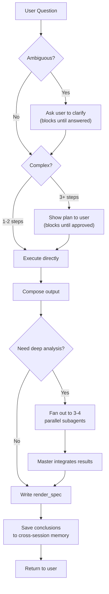
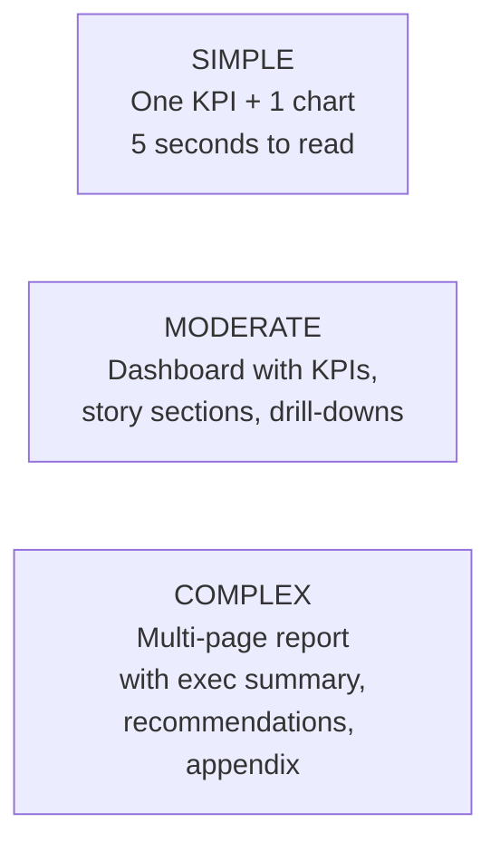
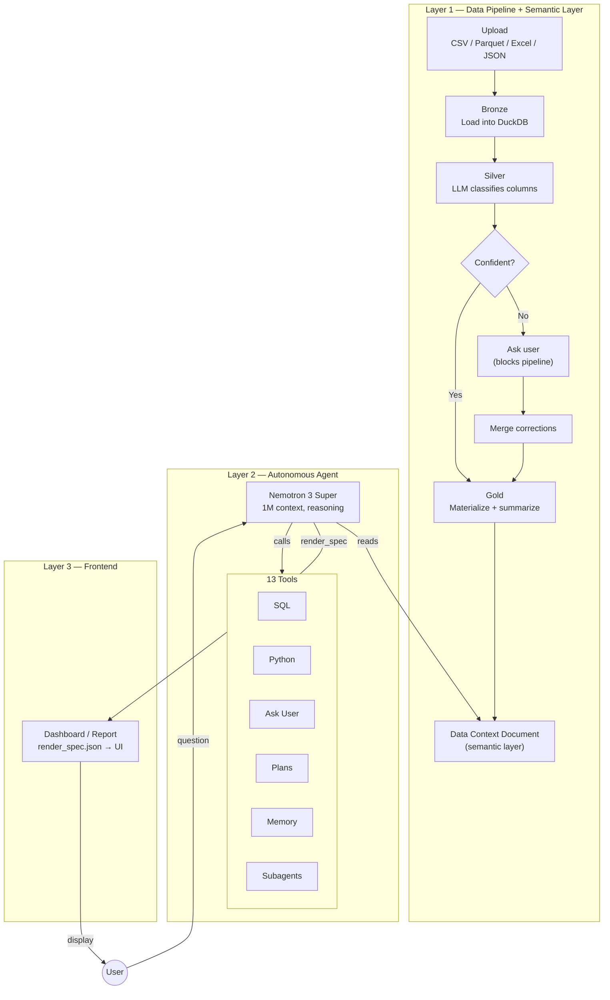
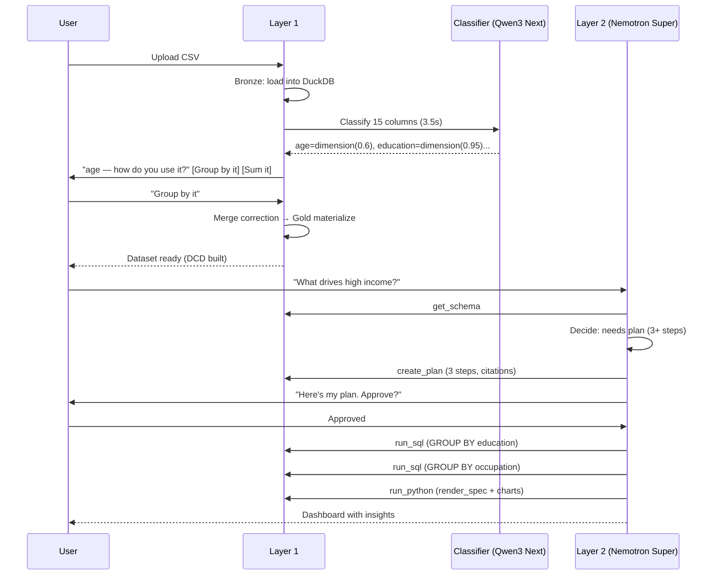

# Manthan

### Seamless Self-Service Intelligence — Talk to Data

[](https://github.com/hitakshiA/Manthan/actions/workflows/ci.yml)
[](https://www.python.org/downloads/)
[](LICENSE)
[]()
[](http://142.93.213.82:8000/health)

> **NatWest Code for Purpose Hackathon — "Talk to Data" Theme**
>
> Most teams build a chatbot that converts text to SQL. We built an **autonomous data analyst** — an agent that understands your data semantically, asks you questions when it's unsure, shows its plan before executing, remembers what it learned yesterday, and produces professional dashboards — not just text responses.

---

## The Problem

Everyone who's tried "talk to your data" tools hits the same wall:

- The AI **hallucinates column meanings** — it treats a payment type code as a number to sum
- It **guesses when it should ask** — "last month" could mean calendar month or trailing 30 days
- It **forgets everything** between sessions — yesterday's analysis is gone today
- When the LLM goes down, **the whole system crashes**
- The output is **a wall of text** — not the dashboard the business user actually needs

## How Manthan Solves It

### The Semantic Layer That Prevents Hallucination

When you upload a dataset, Manthan doesn't just dump it into a database. It builds a **Data Context Document (DCD)** — a semantic layer that tells the AI what each column actually means:

```yaml
columns:
  - name: payment_type
    role: dimension          # NOT a metric — don't SUM this
    description: "How the passenger paid"
    
  - name: fare_amount
    role: metric
    aggregation: SUM         # THIS is what you sum
    description: "Metered fare for the trip"
```

If the LLM classifier is unsure about a column, **it asks you before proceeding** — not after producing a wrong answer:

```
Manthan: "'age' has 74 different numeric values (like 35, 59, 56).
          How do you use it?"
          
  [I'd calculate with it (sum, average)]  [I'd group or filter by it]  [It's an ID]
```

Your answer gets baked into the DCD **before** any analysis happens. Every query the agent writes afterward is grounded in definitions you confirmed — not the LLM's guesses.

### The Autonomous Agent That Thinks Before Acting

The agent doesn't just translate your question to SQL. It reasons through a decision loop:



Real example from our live server (95 seconds, fully autonomous):

```
User:     "What percentage of people earn over $50k?"
Agent:    → get_schema (understands 15 columns, their roles)
          → run_sql (SELECT income, COUNT(*) GROUP BY 1)
          → run_python (computes 23.93%, generates chart)
          → "23.93% of people earn over $50k" + visualization
```

### Three Output Modes — Not Just Text

The agent decides the right output complexity for each question:



Each mode produces a structured `render_spec.json` that Layer 3 renders — the agent decides what charts to show, what the headline number is, and how to tell the story.

---

## Run It

```bash
git clone https://github.com/hitakshiA/Manthan.git && cd Manthan
cp .env.example .env   # add your OPENROUTER_API_KEY

# One command
docker compose up --build

# Health check
curl http://localhost:8000/health
```

Or without Docker:
```bash
python -m venv .venv && source .venv/bin/activate
pip install -e ".[dev]"
uvicorn src.main:app --reload
```

### Upload a dataset and ask a question:
```bash
# Upload
curl -X POST http://localhost:8000/datasets/upload -F "file=@your_data.csv"

# Ask the agent
curl -X POST http://localhost:8000/agent/query/sync \
  -H "Content-Type: application/json" \
  -d '{"session_id": "s1", "dataset_id": "ds_...", "message": "What drives revenue?"}'
```

### Live deployment: **http://142.93.213.82:8000**

---

## Architecture



### Why a Semantic Layer Matters

Without a semantic layer, the LLM sees raw DDL:
```sql
-- LLM sees: payment_type INTEGER
-- LLM thinks: "INTEGER = number = let me SUM it"
-- Result: SUM(payment_type) = 7,421,832  ← meaningless garbage
```

With Manthan's DCD:
```yaml
payment_type:
  role: dimension    # "don't aggregate this"
  description: "1=Credit, 2=Cash, 3=No charge, 4=Dispute"
```

The agent never sums a dimension. Every query is grounded in confirmed definitions.

---

## What Makes This Different

| Capability | Manthan | Typical text-to-SQL chatbot |
|---|---|---|
| **Asks before guessing** | Blocks pipeline on ambiguous columns; blocks agent on ambiguous questions | Guesses and produces wrong answers silently |
| **Semantic layer** | DCD with confirmed column roles, aggregation rules, verified queries | Raw DDL or no schema at all |
| **Plan approval** | Agent shows its plan, user approves before expensive work runs | Executes immediately, no visibility |
| **Cross-session memory** | SQLite-backed, survives restart, agent recalls yesterday's analysis | Stateless — every session starts from scratch |
| **Multi-agent fan-out** | Master spawns 3-4 subagents for parallel analysis, integrates results | Single-threaded sequential |
| **Output modes** | Simple (KPI card), Moderate (dashboard), Complex (multi-page report) | Text + maybe one chart |
| **LLM resilience** | 3-model cascade + heuristic fallback — never crashes | Single model, crashes on rate limit |
| **Dataset persistence** | Rehydrates from disk on restart — uploaded data survives | Lost on restart |

---

## The Pipeline



---

## Configuration

```bash
# .env — all you need
OPENROUTER_API_KEY=sk-or-...       # required (get free at openrouter.ai)
OPENROUTER_FREE_TIER=true          # true=$0 rate-limited, false=paid fast
```

| Variable | Default | Description |
|---|---|---|
| `OPENROUTER_FREE_TIER` | `true` | Free ($0, rate-limited) or paid (fast) |
| `OPENROUTER_MODEL` | `qwen/qwen3-next-80b-a3b-instruct` | Layer 1 classifier |
| `AGENT_MODEL` | `nvidia/nemotron-3-super-120b-a12b` | Layer 2 reasoning |
| `AGENT_FREE_TIER` | `true` | Agent model free/paid toggle |

All models have free tiers. No credit card needed to run.

---

## API Surface

### Data Pipeline (Layer 1)
| Endpoint | What it does |
|---|---|
| `POST /datasets/upload` | Upload → classify → ask user if unsure → materialize Gold |
| `POST /datasets/upload-multi` | Multi-file with auto FK detection |
| `GET /datasets/{id}/context` | Semantic DCD as YAML (query-pruned) |
| `GET /datasets/{id}/schema` | Compact JSON schema |

### Agent (Layer 2)
| Endpoint | What it does |
|---|---|
| `POST /agent/query` | **SSE stream** — real-time thinking, tool calls, results, progress |
| `POST /agent/query/sync` | Synchronous — returns full result JSON |

### Tools (13 endpoints)
| Endpoint | What it does |
|---|---|
| `POST /tools/sql` | Read-only SQL + DESCRIBE + temp tables |
| `POST /tools/python` | Stateful sandbox with all tables as views |
| `POST /plans` | Structured plan with approval gate |
| `POST /ask_user` | Blocking human-in-the-loop |
| `POST /memory` | Persistent cross-session store |
| `POST /subagents/spawn` | Isolated parallel analysis |
| `GET /tools/list` | Full tool manifest for discovery |

---

## Benchmark Results

### CORGI Benchmark (hardest public text-to-SQL benchmark for business)

Tested against [CORGI](https://github.com/corgibenchmark/CORGI) — synthetic databases modeled after DoorDash, Lululemon, Turo with 18-35 tables per database, 25-68 foreign keys, and queries requiring 7+ JOINs on average.

| Database | Tables | FKs | Rows | Agent Result |
|---|---|---|---|---|
| Food Delivery (DoorDash) | 32 | 25 | 75K | **8/8 passed** — top restaurants, delivery analysis, promotion recommendations |
| Clothing E-commerce (Lululemon) | 35 | 40 | 140K | **6/6 passed** — return rate analysis, overstock detection, sales breakdown |
| Car Rental (Turo) | 31 | 68 | 169K | **6/6 passed** — vehicle pricing, cancellation patterns, segment comparison |

The agent autonomously discovers 30+ tables via `SHOW TABLES`, describes relevant ones, writes multi-table JOINs, and produces structured answers — all without human guidance.

### Layer 1 Stress Test

| Dataset | Rows | Cols | Ingest Time |
|---|---|---|---|
| NYC Yellow Taxi Jan 2024 | 2,964,624 | 19 | 8.4s |
| UCI Adult Census | 48,842 | 15 | 6.1s |
| Ames Housing | 2,930 | 82 | 17.9s |
| Lahman Baseball (10 files) | 366,639 | 7-50/table | 51s |

---

## Tech Stack

| Component | Technology | Why |
|---|---|---|
| API Server | FastAPI + uvicorn | Async, SSE streaming, OpenAPI docs |
| Database | DuckDB (in-memory + Parquet) | Analytical queries, zero-config |
| LLM (both layers) | gpt-oss-120b (4.3s/call, 100% uptime) | Fast, reliable, free+paid tiers |
| Persistence | SQLite WAL | Memory + plan audit survive restart |
| Sandbox | Python subprocess REPL | Stateful sessions, variable persistence |

All dependencies are Apache 2.0, MIT, or BSD licensed.

---

## Project Structure

```
src/
  agent/            # Layer 2: autonomous agent loop, tools, prompt, SSE events
  api/              # 13 FastAPI routers (datasets, tools, agent, plans, memory...)
  core/             # State, config, LLM client, rate limiting, memory, plans
  ingestion/        # Bronze: 5 format loaders, FK detection, registry
  profiling/        # Silver: LLM + heuristic classifier, interactive clarification
  semantic/         # DCD schema, generator, render spec models
  materialization/  # Gold: optimizer, summarizer, verified query generator
  tools/            # SQL tool, Python session manager
  sandbox/          # REPL worker subprocess
tests/              # 294 tests across 7 directories
```

## Dev

```bash
pip install -e ".[dev]"
ruff format src/ tests/ && ruff check src/ tests/
pytest tests/ -q  # 294 tests, ~14s
```

## License

[Apache 2.0](LICENSE)
