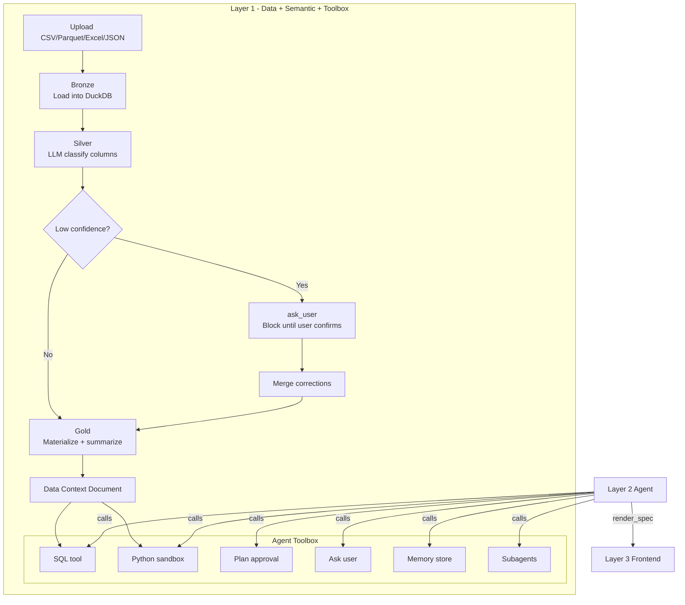
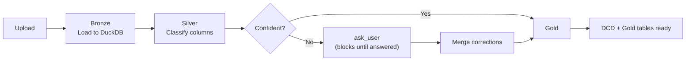
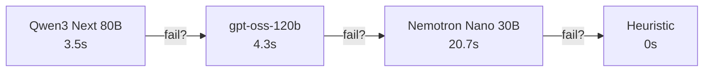
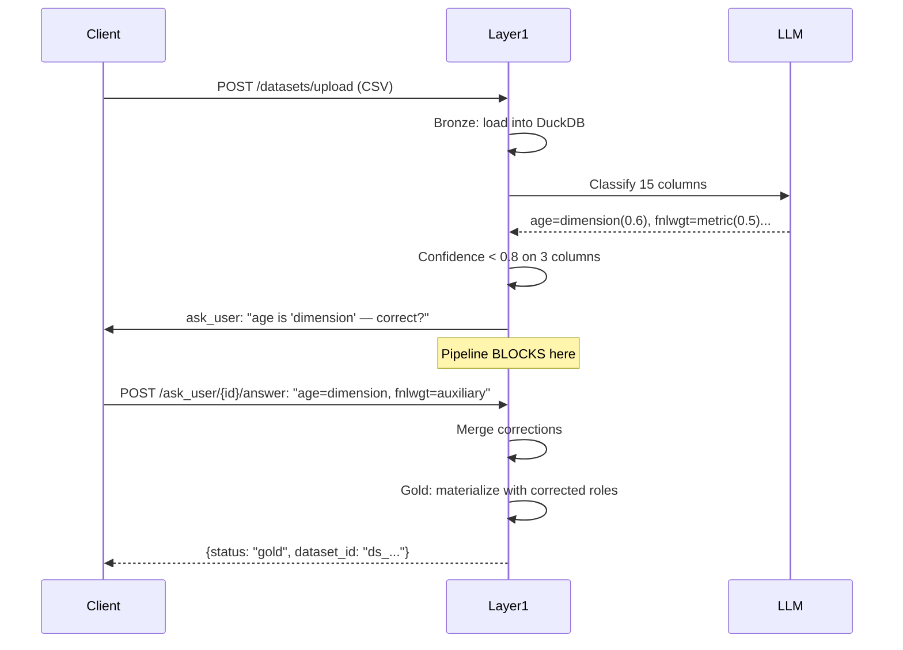
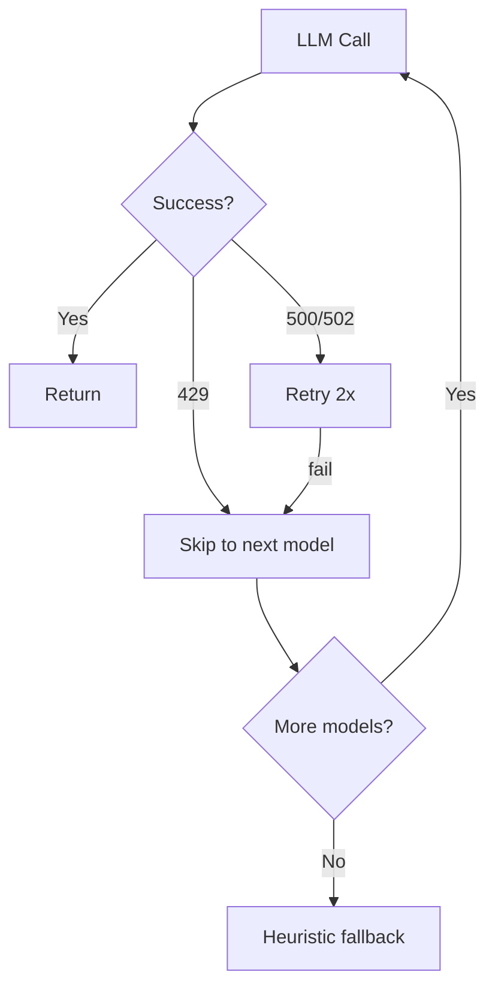

# Manthan

**Seamless Self-Service Intelligence — Talk to Data**

[](https://github.com/hitakshiA/Manthan/actions/workflows/ci.yml)
[](https://www.python.org/downloads/)
[](LICENSE)

Upload any dataset. Get a semantic understanding of your data. Query it with SQL or Python. Build dashboards with an autonomous agent.

Manthan is a 3-layer autonomous data analyst platform:
- **Layer 1** (this repo) — data pipeline + semantic layer + agent toolbox
- **Layer 2** (planned) — autonomous LLM agent that uses Layer 1's tools
- **Layer 3** (planned) — frontend that renders the agent's output as dashboards/reports

## Run It

```bash
git clone https://github.com/hitakshiA/Manthan.git && cd Manthan
cp .env.example .env   # add your OPENROUTER_API_KEY

# Docker (recommended)
docker compose up --build

# Or without Docker
python -m venv .venv && source .venv/bin/activate
pip install -e ".[dev]"
uvicorn src.main:app --reload
```

Health check: `curl http://localhost:8000/health`

## Architecture



## How the Pipeline Works



**One LLM call per dataset.** The classifier looks at column names, types, and 3 sample values, then assigns roles (metric/dimension/temporal/identifier/auxiliary). If confidence is low on any column, the pipeline **blocks and asks the user** before materializing Gold — so the DCD is correct from the start.

## Model Cascade

Three models across three providers. 429 on one = instant skip to next.



```bash
# Free tier ($0, rate-limited)
OPENROUTER_FREE_TIER=true

# Paid tier (fast, uses your balance)
OPENROUTER_FREE_TIER=false
```

## Interactive Clarification

When the classifier is unsure, the upload **blocks** and asks the user:



Real example from live VPS (7.8s total including the round-trip):
```
Upload adult.csv (48,842 rows, 15 cols)
  → LLM flags age, fnlwgt, sex as low-confidence
  → User corrects: age=dimension, fnlwgt=auxiliary
  → Gold materializes with corrected roles
  → DCD correct from the start — no post-hoc fixes needed
```

## API

### Data Pipeline
| Endpoint | What it does |
|---|---|
| `POST /datasets/upload` | Upload file, classify, ask user if unsure, materialize Gold |
| `POST /datasets/upload-multi` | Upload related files, auto-detect foreign keys |
| `GET /datasets/{id}/context` | Semantic DCD as YAML (with query-based pruning) |
| `GET /datasets/{id}/schema` | Compact JSON schema |

### Analysis Tools
| Endpoint | What it does |
|---|---|
| `POST /tools/sql` | Read-only SQL + DESCRIBE + SHOW TABLES + temp table scratchpad |
| `POST /tools/python` | Stateful sandbox (df, con with all tables as views, OUTPUT_DIR) |
| `GET /tools/list` | Tool manifest for agent discovery (13 tools) |

### Agent Primitives
| Endpoint | What it does |
|---|---|
| `POST /plans` | Structured plan with DCD citations + approval gate |
| `POST /plans/{id}/wait` | Long-poll until user approves/rejects |
| `POST /ask_user` | Blocking human-in-the-loop clarification |
| `POST /ask_user/{id}/wait` | Long-poll until user answers |
| `POST /memory` | Persistent cross-session KV store (SQLite, survives restart) |
| `POST /subagents/spawn` | Isolated workspaces with memory bridging to parent |
| `POST /tasks` | Per-session agent task tracking |

## Formats Supported

CSV, TSV, Parquet, Excel (xlsx/xls), JSON/JSONL, Postgres, MySQL, SQLite.

Multi-file uploads auto-detect FK relationships across tables.

## Resilience



- **3-model cascade** across 3 providers (Qwen/OpenAI/NVIDIA) — independent rate limits
- **429 = instant cascade** (no wasted retries on rate-limited models)
- **Heuristic fallback** when all LLMs unavailable
- **Dataset rehydration** from disk on server restart
- **Plan audit trails** + **memory** persist in SQLite across restarts
- **IP rate limiting** (60/min default, 10/min uploads, whitelisted IPs bypass)

## Stress Test Results

Live-tested with 4 real datasets, 5 tiers, 24 scenarios — all passing:

| Dataset | Rows | Cols | Time |
|---|---|---|---|
| NYC Taxi Jan 2024 | 2.96M | 19 | 8.4s |
| UCI Adult | 48.8K | 15 | 6.1s |
| Ames Housing | 2.9K | 82 | 17.9s |
| Lahman Baseball (10 files) | 366K | 7-50/table | 51s |

Full report: [`docs/layer1_stress_test_report.md`](docs/layer1_stress_test_report.md)

## Project Structure

```
src/
  api/              # 12 FastAPI routers
  core/             # State, config, LLM client, memory, plans, rate limiting
  ingestion/        # Bronze: loaders, registry, FK detection
  profiling/        # Silver: stats, LLM + heuristic classifier, clarification
  semantic/         # DCD schema, generator, render spec models
  materialization/  # Gold: optimizer, summarizer, query gen
  tools/            # SQL tool, Python session manager
  sandbox/          # Python REPL worker
tests/              # 294 tests
```

## Docs

| Document | Description |
|---|---|
| [`docs/LAYER1_SPEC.md`](docs/LAYER1_SPEC.md) | Complete Layer 1 technical spec |
| [`docs/LAYER2_OBSERVATIONS.md`](docs/LAYER2_OBSERVATIONS.md) | What Layer 2 needs (from stress test) |
| [`docs/LAYER3_OBSERVATIONS.md`](docs/LAYER3_OBSERVATIONS.md) | What Layer 3 needs (render spec contract) |
| [`docs/layer3_spec_schema.md`](docs/layer3_spec_schema.md) | Render spec JSON schema |

## Dev

```bash
pip install -e ".[dev]"
ruff format src/ tests/ && ruff check src/ tests/
pytest tests/ -q  # 294 tests, ~14s
```

## License

[Apache 2.0](LICENSE)
