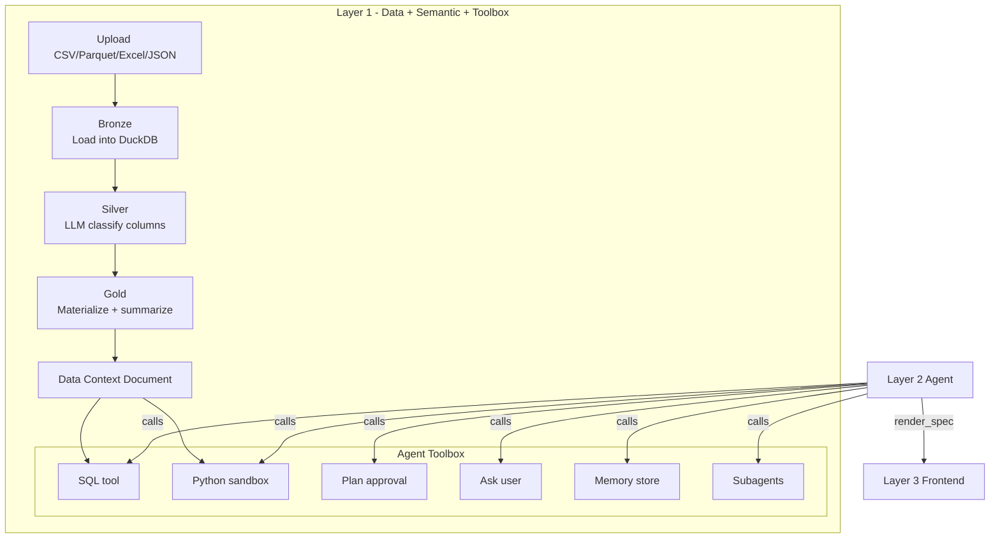
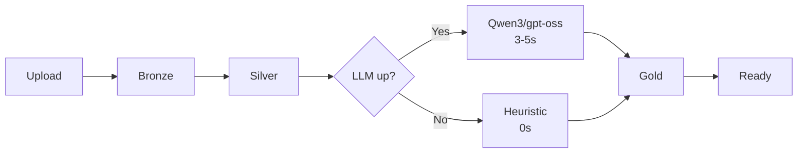

# Manthan

**Seamless Self-Service Intelligence — Talk to Data**

[](https://github.com/hitakshiA/Manthan/actions/workflows/ci.yml)
[](https://www.python.org/downloads/)
[](LICENSE)

Upload any dataset. Get a semantic understanding of your data. Query it with SQL or Python. Build dashboards with an autonomous agent. Manthan is the data + semantic + agent toolbox layer — Layer 1 of a 3-layer autonomous data analyst.

## Run It (1 command)

```bash
# 1. Clone + configure
git clone https://github.com/hitakshiA/Manthan.git && cd Manthan
cp .env.example .env   # add your OPENROUTER_API_KEY

# 2. Run
docker compose up --build

# 3. Use
curl http://localhost:8000/health
curl -X POST http://localhost:8000/datasets/upload -F "file=@your_data.csv"
```

Or without Docker:

```bash
python -m venv .venv && source .venv/bin/activate
pip install -e ".[dev]"
uvicorn src.main:app --reload
```

## Architecture



## Pipeline



Three models cascade automatically: **Qwen3 Next 80B** (3.5s) -> **gpt-oss-120b** (4.3s) -> **Nemotron Nano** (20.7s) -> heuristic fallback (instant). Each on a different provider so rate limits don't stack.

## Configuration

```bash
# .env
OPENROUTER_API_KEY=sk-or-...         # required
OPENROUTER_FREE_TIER=true            # true=$0 rate-limited, false=paid fast
OPENROUTER_MODEL=qwen/qwen3-next-80b-a3b-instruct
```

## API

### Data Pipeline
| Endpoint | What it does |
|---|---|
| `POST /datasets/upload` | Upload file, run full Bronze->Silver->Gold pipeline |
| `POST /datasets/upload-multi` | Upload related files, auto-detect foreign keys |
| `GET /datasets/{id}/context` | Get semantic DCD as YAML |
| `GET /datasets/{id}/schema` | Compact JSON schema |

### Analysis Tools
| Endpoint | What it does |
|---|---|
| `POST /tools/sql` | Read-only SQL + temp table scratchpad |
| `POST /tools/python` | Stateful Python sandbox (df, con, OUTPUT_DIR pre-loaded) |
| `GET /tools/list` | Tool manifest for agent discovery |

### Agent Primitives
| Endpoint | What it does |
|---|---|
| `POST /plans` | Structured plan with DCD citations + approval gate |
| `POST /ask_user` | Blocking human-in-the-loop clarification |
| `POST /memory` | Persistent cross-session key-value store (SQLite) |
| `POST /subagents/spawn` | Isolated multi-agent workspaces with memory bridging |
| `POST /tasks` | Per-session agent task tracking |

## Formats Supported

CSV, TSV, Parquet, Excel (xlsx/xls), JSON/JSONL, Postgres, MySQL, SQLite.

Multi-file uploads auto-detect FK relationships via value-containment analysis.

## Stress Test Results

Tested with 4 real datasets, 5 complexity tiers, 24 scenarios — all passing:

| Dataset | Rows | Cols | Time |
|---|---|---|---|
| NYC Taxi Jan 2024 | 2.96M | 19 | 8.4s |
| UCI Adult | 48.8K | 15 | 6.1s |
| Ames Housing | 2.9K | 82 | 17.9s |
| Lahman Baseball (10 files) | 366K | 7-50/table | 51s |

## Project Structure

```
src/
  api/              # 12 FastAPI routers
  core/             # State, config, LLM client, memory, plans
  ingestion/        # Bronze: loaders, registry, FK detection
  profiling/        # Silver: stats, LLM + heuristic classifier
  semantic/         # DCD schema, generator, render spec models
  materialization/  # Gold: optimizer, summarizer, query gen
  tools/            # SQL tool, Python session manager
  sandbox/          # Python REPL worker
tests/              # 294 tests
```

## Dev

```bash
pip install -e ".[dev]"
ruff format src/ tests/ && ruff check src/ tests/
pytest tests/ -q
```

## License

[Apache 2.0](LICENSE)
